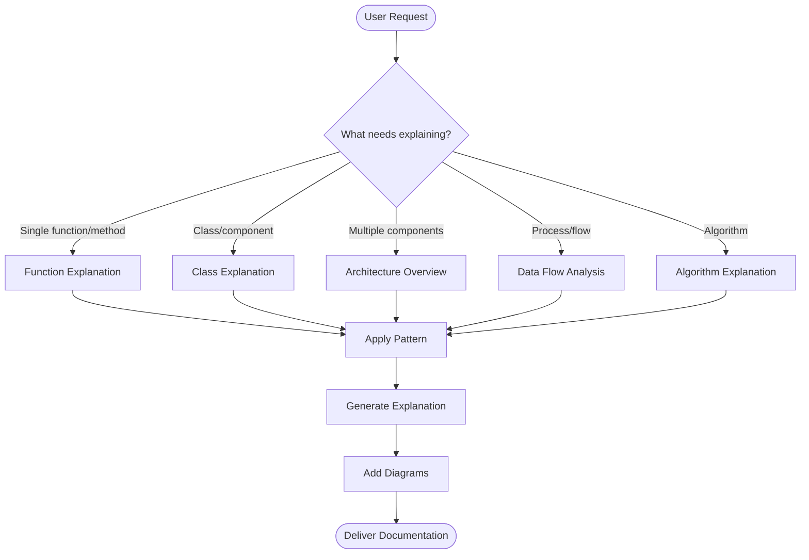

# Code Explainer

## Overview

This skill provides structured, comprehensive code explanations with visual diagrams. It transforms complex code into clear markdown documentation that includes purpose, logic breakdown, flow diagrams, and architectural insights.

## Core Workflow

### 1. Identify Explanation Scope

First, determine what type of explanation is needed:



### 2. Read the Code

Before explaining, **always read the relevant code files** using the Read tool. Never explain code without reading it first.

For large codebases:
- Use Glob to find relevant files: `**/*.py`, `**/*.js`, etc.
- Use Grep to search for specific functions/classes
- Read multiple related files if the code spans components

### 3. Apply Appropriate Pattern

Based on the scope, use the corresponding explanation pattern from [references/explanation-patterns.md](references/explanation-patterns.md):

- **Function/Method**: Use when explaining a single function or method
- **Class/Component**: Use when explaining a class, module, or component
- **Architecture Overview**: Use when explaining system structure or multiple components
- **Data Flow**: Use when explaining how data moves through the system
- **Algorithm**: Use when explaining algorithmic logic or complex processing

### 4. Create Visual Diagrams

Include relevant Mermaid diagrams from [references/mermaid-templates.md](references/mermaid-templates.md):

- **Flowcharts**: For function logic, algorithms, conditional flows
- **Sequence Diagrams**: For API calls, event handling, request-response patterns
- **Class Diagrams**: For OOP structure, design patterns, component relationships
- **State Diagrams**: For object lifecycles, connection states
- **Architecture Diagrams**: For system overview, layered architecture, microservices

### 5. Structure the Explanation

Follow this structure for all explanations:

```markdown
## [Component Name]

### Purpose
[One-sentence what and why]

### [Diagram]
[Appropriate Mermaid diagram]

### [Detailed Sections]
[Pattern-specific sections]

### Key Points
[Important considerations]

### Example Usage (if applicable)
[Code examples]
```

## Explanation Guidelines

### Writing Principles

1. **Start with "Why"**: Always explain the purpose before the implementation
2. **Use Active Voice**: "The function processes data" not "Data is processed"
3. **Progressive Disclosure**: Overview → Details → Examples
4. **Include File References**: Link to code locations with `file.py:123` format
5. **Add Context**: Explain design decisions and trade-offs

### Diagram Best Practices

1. **One Concept Per Diagram**: Keep diagrams focused and clear
2. **Consistent Direction**: Use top-to-bottom or left-to-right flow
3. **Clear Labels**: Every node and edge should be descriptive
4. **Show Error Paths**: Include error handling in flowcharts
5. **Group Related Elements**: Use subgraphs for logical grouping

### Code Reference Format

Always reference code locations in your explanations:

- **Functions**: `process_data()` in [service.py:45](service.py#L45)
- **Classes**: `UserManager` class in [models/user.py:12-89](models/user.py#L12-L89)
- **Files**: [config/settings.py](config/settings.py)

## Common Use Cases

### Case 1: Explaining a New Codebase

**User asks**: "Explain how this project works"

**Approach**:
1. Read main entry points (e.g., `main.py`, `index.js`, `app.py`)
2. Identify directory structure with Glob: `**/`
3. Map component relationships
4. Use **Architecture Overview Pattern** with layered architecture diagram
5. Document key components and their interactions

**Output**: High-level architecture document with component diagram and directory structure

### Case 2: Explaining a Specific Function

**User asks**: "What does the `calculate_metrics()` function do?"

**Approach**:
1. Read the file containing the function
2. Identify parameters, return values, and logic flow
3. Use **Function Explanation Pattern** with flowchart
4. Include complexity analysis if relevant
5. Show example usage

**Output**: Detailed function documentation with logic flowchart

### Case 3: Explaining System Architecture

**User asks**: "How do the components interact in this system?"

**Approach**:
1. Identify all major components with Glob
2. Read component interfaces and dependencies
3. Use **Architecture Overview Pattern** with component relationship diagram
4. Add sequence diagram for key interactions
5. Document data flow between components

**Output**: Architecture documentation with multiple diagrams showing structure and interactions

### Case 4: Documenting for Code Review

**User asks**: "Document this code for review"

**Approach**:
1. Read the code files
2. Apply appropriate pattern (Function, Class, or Architecture)
3. Include design decision rationale
4. Add trade-offs and alternatives considered
5. Highlight edge cases and error handling

**Output**: Review-ready documentation with comprehensive context

### Case 5: Explaining an Algorithm

**User asks**: "How does this sorting algorithm work?"

**Approach**:
1. Read the algorithm implementation
2. Use **Algorithm Explanation Pattern** with flowchart
3. Add step-by-step execution trace with example
4. Include complexity analysis
5. Show visual representation of each step

**Output**: Algorithm documentation with execution trace and complexity analysis

## Resources

### references/explanation-patterns.md

Proven patterns for structuring code explanations. Contains templates for:
- Function/Method explanations
- Class/Component explanations
- Architecture overviews
- Data flow documentation
- Algorithm explanations

**When to read**: At the start of any explanation task to choose the right pattern

### references/mermaid-templates.md

Complete Mermaid diagram reference with syntax and examples for:
- Flowcharts (function logic, algorithms)
- Sequence diagrams (API flows, interactions)
- Class diagrams (OOP structure)
- State diagrams (lifecycles)
- ER diagrams (data models)
- Architecture diagrams (system structure)

**When to read**: When creating diagrams for your explanation

## Tips for Effective Explanations

### Multi-File Analysis

When code spans multiple files:
1. Start with the entry point
2. Follow the execution path
3. Document component boundaries
4. Show interaction patterns with sequence diagrams

### Handling Complex Logic

For complex code:
1. Break into logical sections
2. Explain each section separately
3. Show how sections connect
4. Use multiple diagrams if needed (one per concept)

### Domain-Specific Code

For domain-specific code (ML, finance, etc.):
1. Explain domain concepts first
2. Link code to domain terminology
3. Include domain-specific diagrams
4. Reference external documentation

### Legacy Code

When explaining legacy code:
1. Document what it does (not what it should do)
2. Note code smells or technical debt
3. Suggest improvements separately
4. Focus on understanding before refactoring

## Output Format

Always deliver explanations as:
- **Structured Markdown**: Clear headings and formatting
- **Mermaid Diagrams**: Visual representations of logic and structure
- **Code References**: Links to file:line locations
- **Examples**: Concrete usage examples where applicable
- **Context**: Design decisions and trade-offs

The goal is to make complex code understandable through progressive disclosure, visual aids, and clear writing.
