# Mermaid Diagram Templates

Complete reference for Mermaid diagrams used in code explanations. Each template includes syntax and real-world examples.

## Table of Contents

1. [Flowchart Diagrams](#flowchart-diagrams)
2. [Sequence Diagrams](#sequence-diagrams)
3. [Class Diagrams](#class-diagrams)
4. [State Diagrams](#state-diagrams)
5. [Entity Relationship Diagrams](#entity-relationship-diagrams)
6. [Architecture Diagrams](#architecture-diagrams)

---

## Flowchart Diagrams

### Basic Syntax

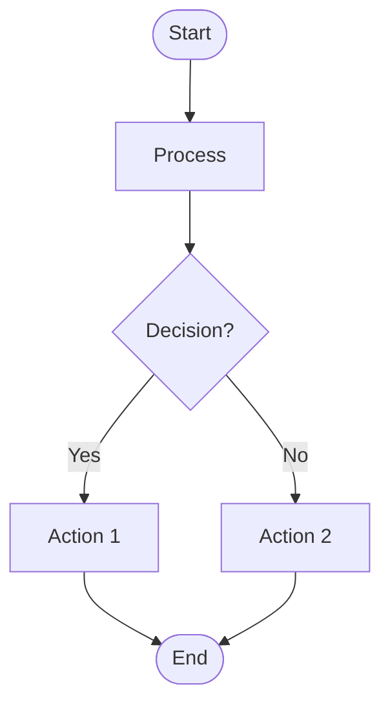
```mermaid
flowchart TD
    Start([Start]) --> Process[Process]
    Process --> Decision{Decision?}
    Decision -->|Yes| Action1[Action 1]
    Decision -->|No| Action2[Action 2]
    Action1 --> End([End])
    Action2 --> End
```

### Node Shapes

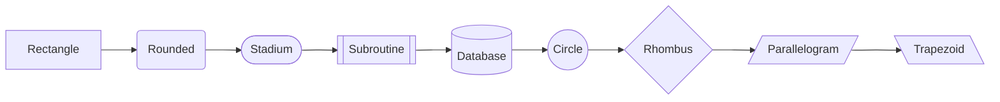
```mermaid
flowchart LR
    A[Rectangle] --> B(Rounded)
    B --> C([Stadium])
    C --> D[[Subroutine]]
    D --> E[(Database)]
    E --> F((Circle))
    F --> G{Rhombus}
    G --> H[/Parallelogram/]
    H --> I[\Trapezoid\]
```

### Common Use Cases

#### Function Logic Flow
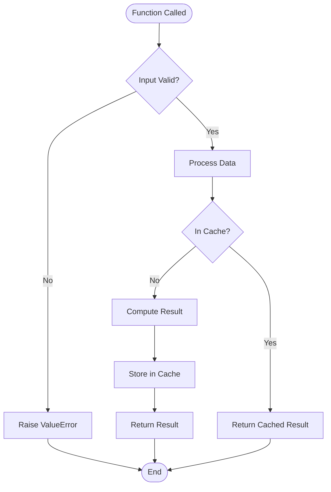
```mermaid
flowchart TD
    Start([Function Called]) --> ValidateInput{Input Valid?}
    ValidateInput -->|No| RaiseError[Raise ValueError]
    ValidateInput -->|Yes| ProcessData[Process Data]
    ProcessData --> CheckCache{In Cache?}
    CheckCache -->|Yes| ReturnCached[Return Cached Result]
    CheckCache -->|No| Compute[Compute Result]
    Compute --> Cache[Store in Cache]
    Cache --> Return[Return Result]
    RaiseError --> End([End])
    Return --> End
    ReturnCached --> End
```

#### Conditional Branching
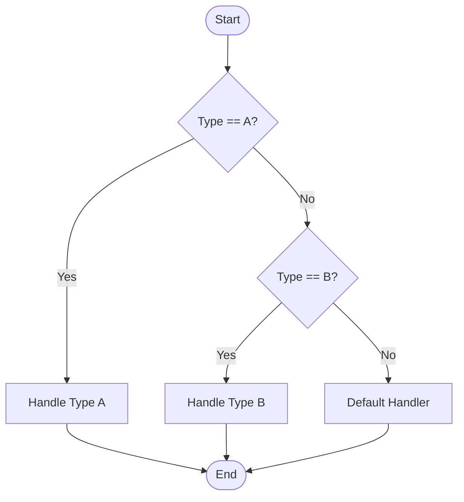
```mermaid
flowchart TD
    Start([Start]) --> Check1{Type == A?}
    Check1 -->|Yes| ProcessA[Handle Type A]
    Check1 -->|No| Check2{Type == B?}
    Check2 -->|Yes| ProcessB[Handle Type B]
    Check2 -->|No| Default[Default Handler]
    ProcessA --> End([End])
    ProcessB --> End
    Default --> End
```

#### Loop Processing
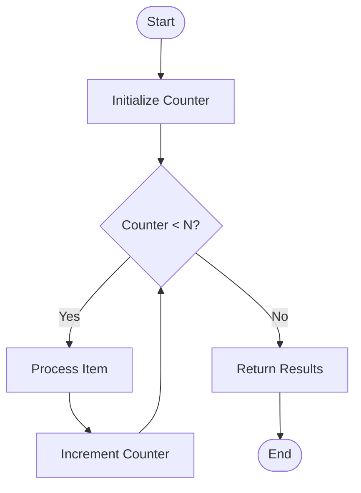
```mermaid
flowchart TD
    Start([Start]) --> Init[Initialize Counter]
    Init --> Loop{Counter < N?}
    Loop -->|Yes| Process[Process Item]
    Process --> Increment[Increment Counter]
    Increment --> Loop
    Loop -->|No| Return[Return Results]
    Return --> End([End])
```

---

## Sequence Diagrams

### Basic Syntax

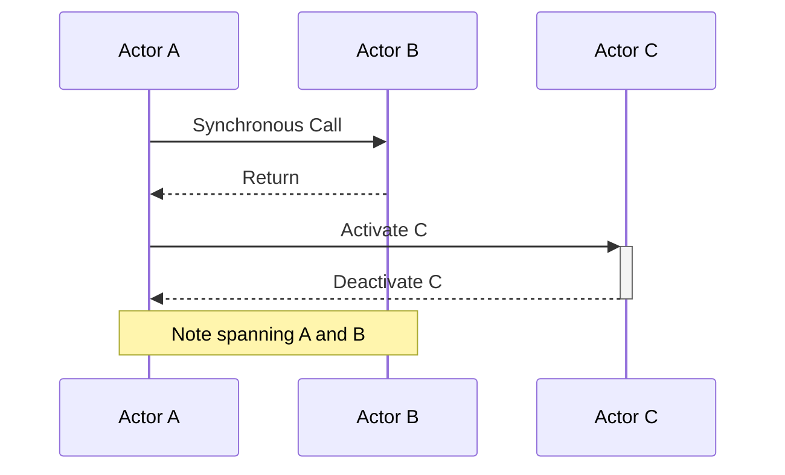
```mermaid
sequenceDiagram
    participant A as Actor A
    participant B as Actor B
    participant C as Actor C

    A->>B: Synchronous Call
    B-->>A: Return
    A->>+C: Activate C
    C-->>-A: Deactivate C
    Note over A,B: Note spanning A and B
```

### Common Use Cases

#### API Request Flow
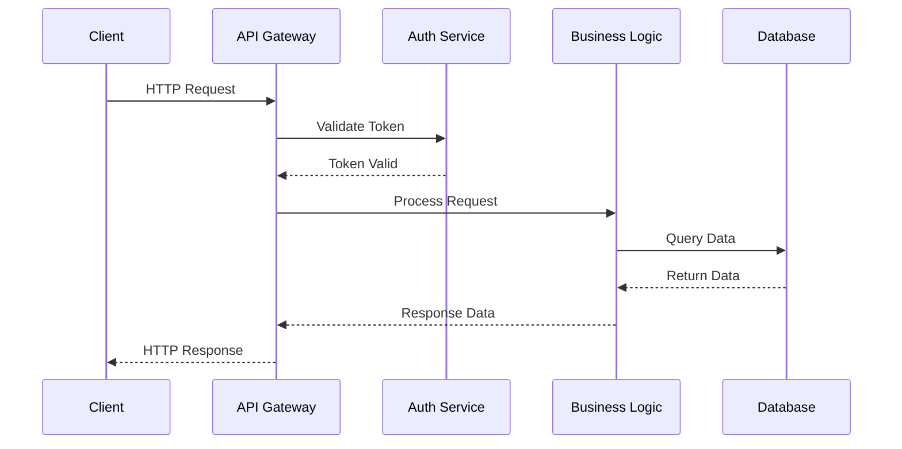
```mermaid
sequenceDiagram
    participant Client
    participant API Gateway
    participant Auth Service
    participant Business Logic
    participant Database

    Client->>API Gateway: HTTP Request
    API Gateway->>Auth Service: Validate Token
    Auth Service-->>API Gateway: Token Valid
    API Gateway->>Business Logic: Process Request
    Business Logic->>Database: Query Data
    Database-->>Business Logic: Return Data
    Business Logic-->>API Gateway: Response Data
    API Gateway-->>Client: HTTP Response
```

#### Event Handling
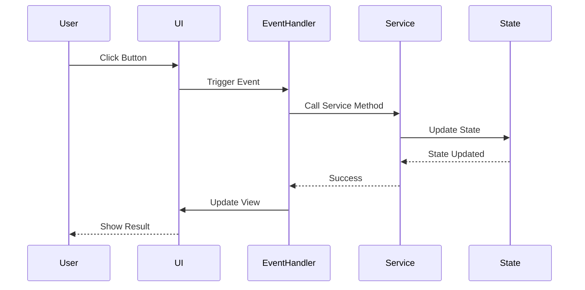
```mermaid
sequenceDiagram
    participant User
    participant UI
    participant EventHandler
    participant Service
    participant State

    User->>UI: Click Button
    UI->>EventHandler: Trigger Event
    EventHandler->>Service: Call Service Method
    Service->>State: Update State
    State-->>Service: State Updated
    Service-->>EventHandler: Success
    EventHandler->>UI: Update View
    UI-->>User: Show Result
```

#### Error Handling Flow
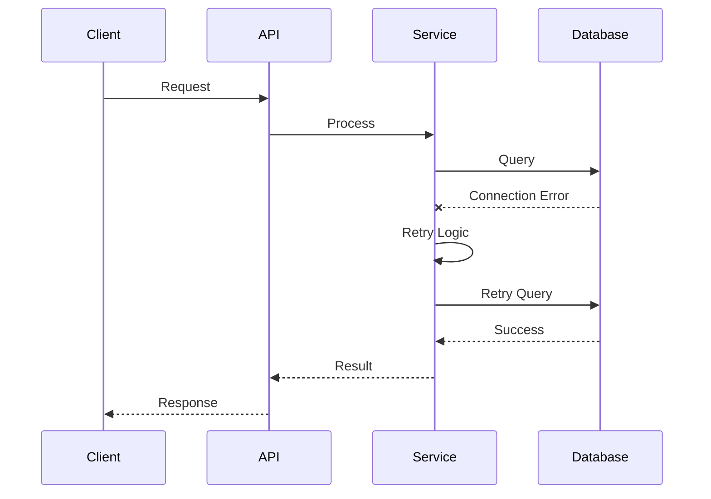
```mermaid
sequenceDiagram
    participant Client
    participant API
    participant Service
    participant Database

    Client->>API: Request
    API->>Service: Process
    Service->>Database: Query
    Database--xService: Connection Error
    Service->>Service: Retry Logic
    Service->>Database: Retry Query
    Database-->>Service: Success
    Service-->>API: Result
    API-->>Client: Response
```

---

## Class Diagrams

### Basic Syntax

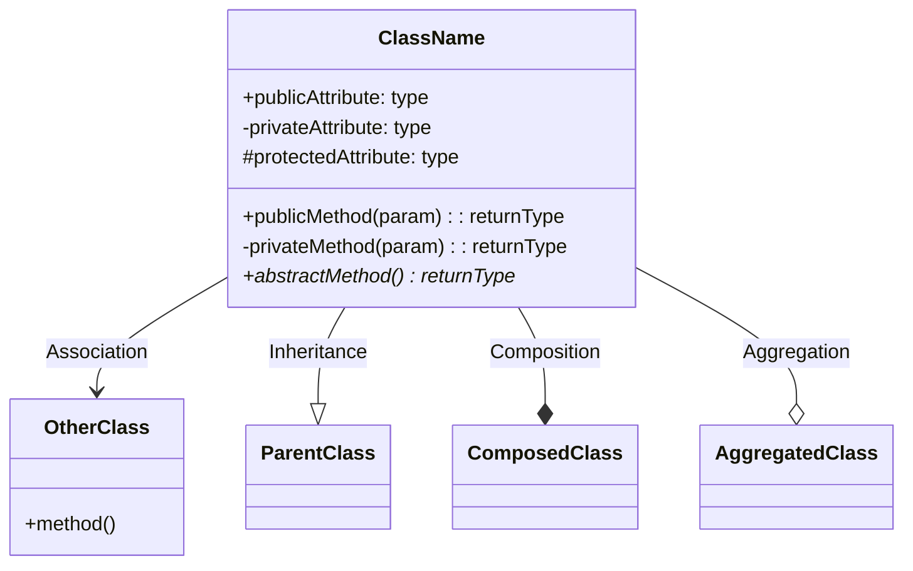
```mermaid
classDiagram
    class ClassName {
        +publicAttribute: type
        -privateAttribute: type
        #protectedAttribute: type
        +publicMethod(param): returnType
        -privateMethod(param): returnType
        +abstractMethod()* returnType
    }

    class OtherClass {
        +method()
    }

    ClassName --> OtherClass : Association
    ClassName --|> ParentClass : Inheritance
    ClassName --* ComposedClass : Composition
    ClassName --o AggregatedClass : Aggregation
```

### Common Use Cases

#### OOP Structure
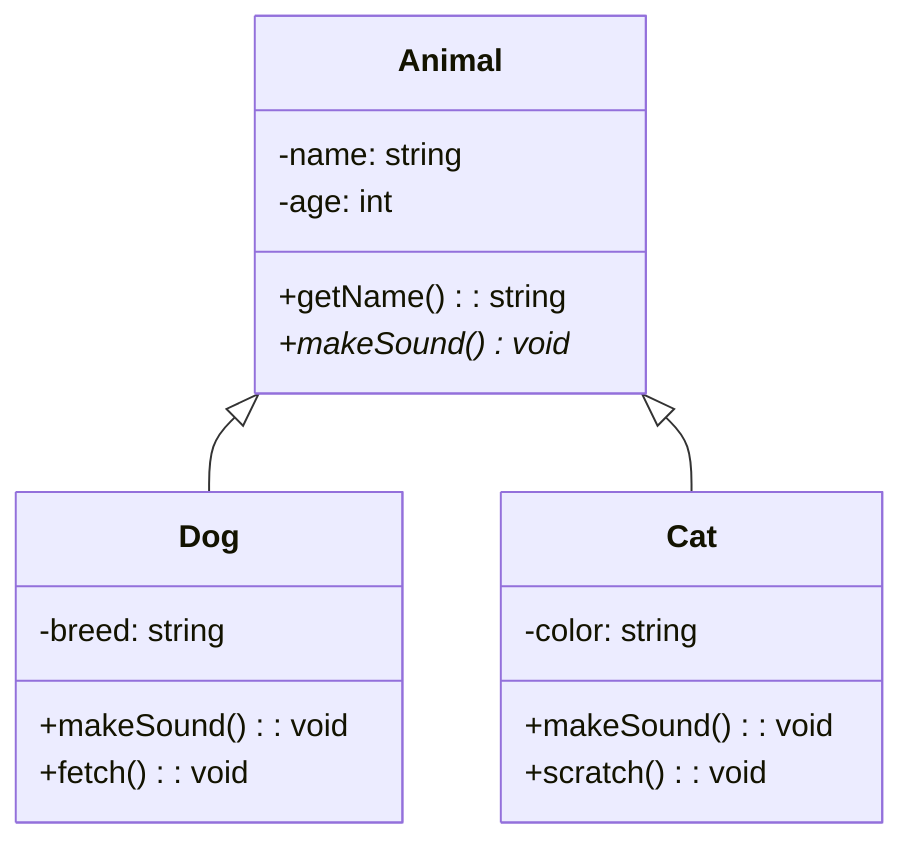
```mermaid
classDiagram
    class Animal {
        -name: string
        -age: int
        +getName(): string
        +makeSound()* void
    }

    class Dog {
        -breed: string
        +makeSound(): void
        +fetch(): void
    }

    class Cat {
        -color: string
        +makeSound(): void
        +scratch(): void
    }

    Animal <|-- Dog
    Animal <|-- Cat
```

#### Design Pattern (Strategy)
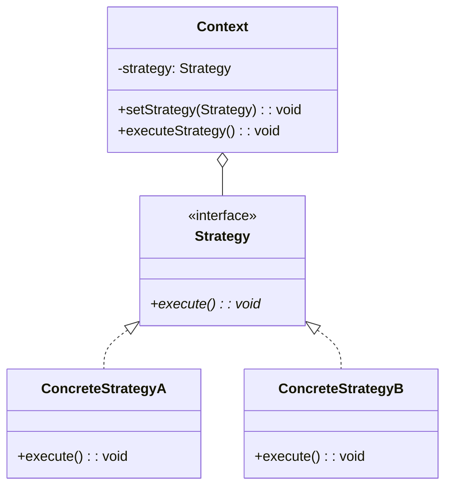
```mermaid
classDiagram
    class Context {
        -strategy: Strategy
        +setStrategy(Strategy): void
        +executeStrategy(): void
    }

    class Strategy {
        <<interface>>
        +execute()*: void
    }

    class ConcreteStrategyA {
        +execute(): void
    }

    class ConcreteStrategyB {
        +execute(): void
    }

    Context o-- Strategy
    Strategy <|.. ConcreteStrategyA
    Strategy <|.. ConcreteStrategyB
```

#### System Components
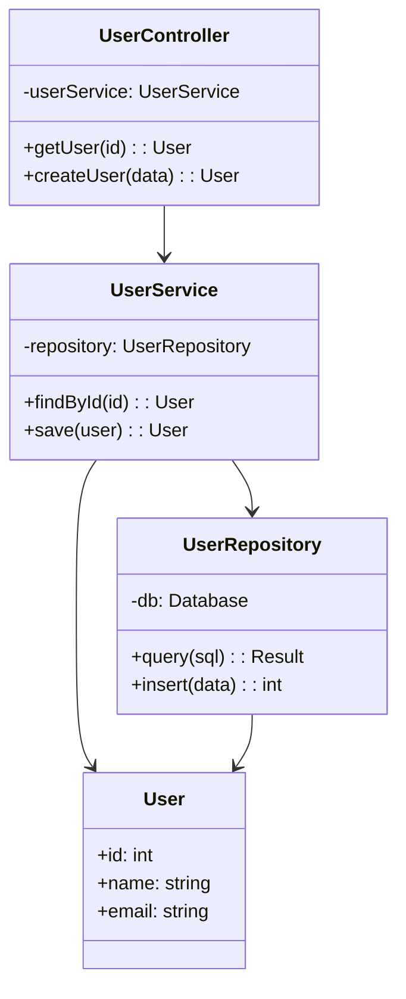
```mermaid
classDiagram
    class UserController {
        -userService: UserService
        +getUser(id): User
        +createUser(data): User
    }

    class UserService {
        -repository: UserRepository
        +findById(id): User
        +save(user): User
    }

    class UserRepository {
        -db: Database
        +query(sql): Result
        +insert(data): int
    }

    class User {
        +id: int
        +name: string
        +email: string
    }

    UserController --> UserService
    UserService --> UserRepository
    UserService --> User
    UserRepository --> User
```

---

## State Diagrams

### Basic Syntax

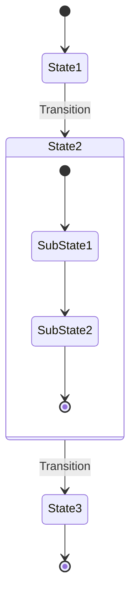
```mermaid
stateDiagram-v2
    [*] --> State1
    State1 --> State2 : Transition
    State2 --> State3 : Transition
    State3 --> [*]

    state State2 {
        [*] --> SubState1
        SubState1 --> SubState2
        SubState2 --> [*]
    }
```

### Common Use Cases

#### Object Lifecycle
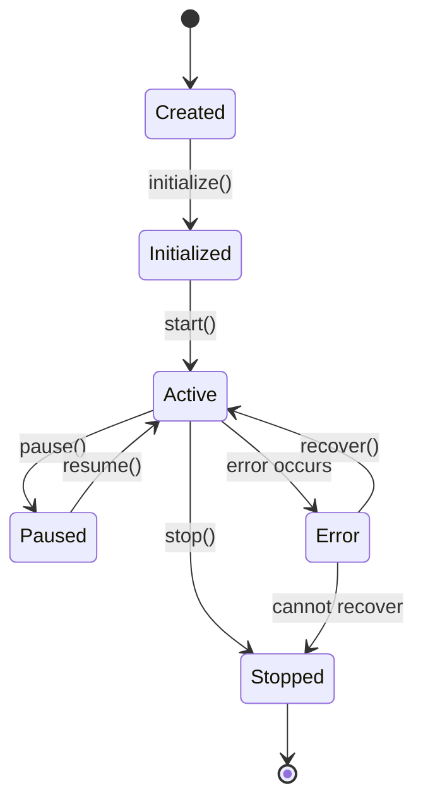
```mermaid
stateDiagram-v2
    [*] --> Created
    Created --> Initialized : initialize()
    Initialized --> Active : start()
    Active --> Paused : pause()
    Paused --> Active : resume()
    Active --> Stopped : stop()
    Stopped --> [*]

    Active --> Error : error occurs
    Error --> Active : recover()
    Error --> Stopped : cannot recover
```

#### Connection States
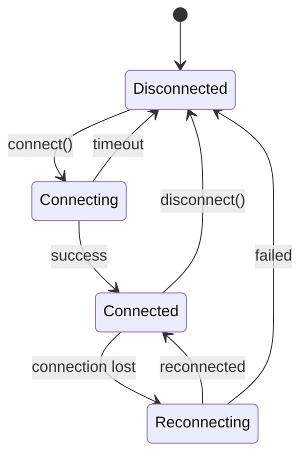
```mermaid
stateDiagram-v2
    [*] --> Disconnected
    Disconnected --> Connecting : connect()
    Connecting --> Connected : success
    Connecting --> Disconnected : timeout
    Connected --> Disconnected : disconnect()
    Connected --> Reconnecting : connection lost
    Reconnecting --> Connected : reconnected
    Reconnecting --> Disconnected : failed
```

#### Request Processing States
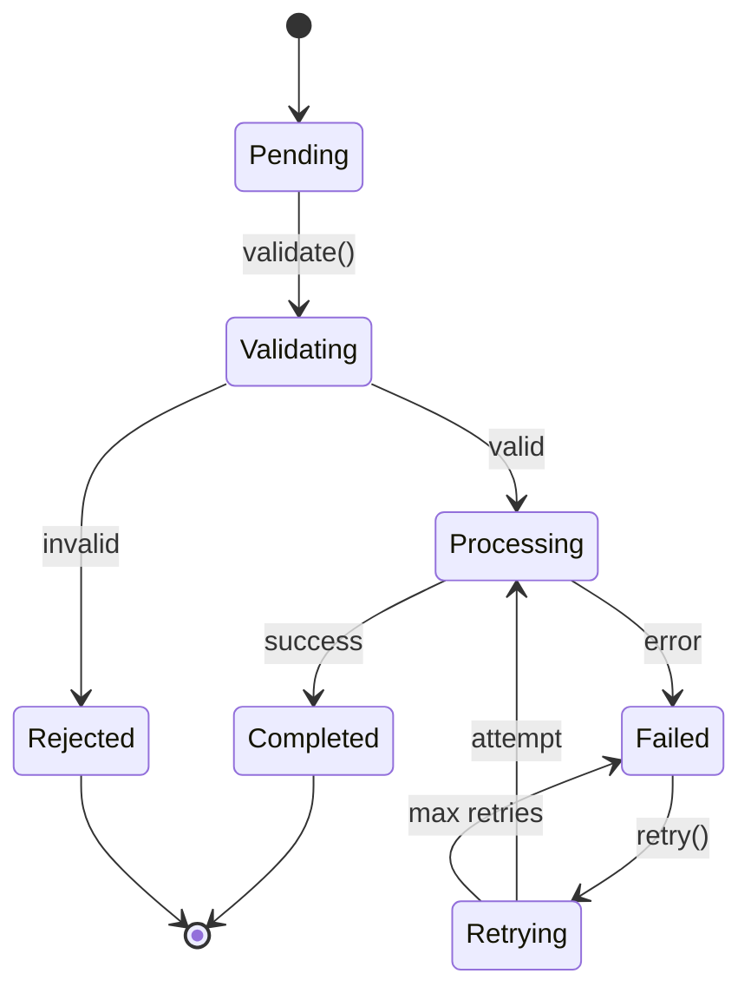
```mermaid
stateDiagram-v2
    [*] --> Pending
    Pending --> Validating : validate()
    Validating --> Processing : valid
    Validating --> Rejected : invalid
    Processing --> Completed : success
    Processing --> Failed : error
    Completed --> [*]
    Rejected --> [*]
    Failed --> Retrying : retry()
    Retrying --> Processing : attempt
    Retrying --> Failed : max retries
```

---

## Entity Relationship Diagrams

### Basic Syntax

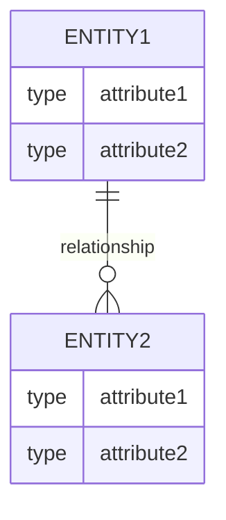
```mermaid
erDiagram
    ENTITY1 ||--o{ ENTITY2 : relationship
    ENTITY1 {
        type attribute1
        type attribute2
    }
    ENTITY2 {
        type attribute1
        type attribute2
    }
```

### Relationship Types
- `||--||` : One to one
- `||--o{` : One to many
- `}o--o{` : Many to many
- `||..||` : One to one (optional)

### Common Use Cases

#### Database Schema
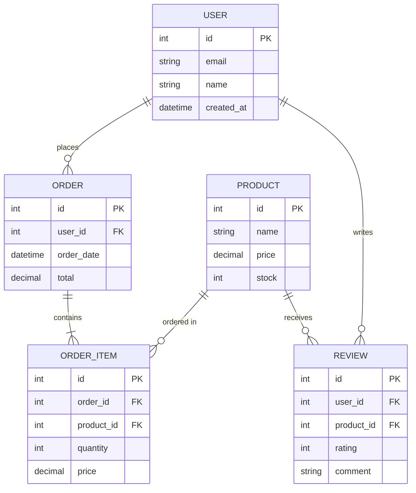
```mermaid
erDiagram
    USER ||--o{ ORDER : places
    USER ||--o{ REVIEW : writes
    ORDER ||--|{ ORDER_ITEM : contains
    PRODUCT ||--o{ ORDER_ITEM : "ordered in"
    PRODUCT ||--o{ REVIEW : receives

    USER {
        int id PK
        string email
        string name
        datetime created_at
    }

    ORDER {
        int id PK
        int user_id FK
        datetime order_date
        decimal total
    }

    PRODUCT {
        int id PK
        string name
        decimal price
        int stock
    }

    ORDER_ITEM {
        int id PK
        int order_id FK
        int product_id FK
        int quantity
        decimal price
    }

    REVIEW {
        int id PK
        int user_id FK
        int product_id FK
        int rating
        string comment
    }
```

---

## Architecture Diagrams

### Layered Architecture
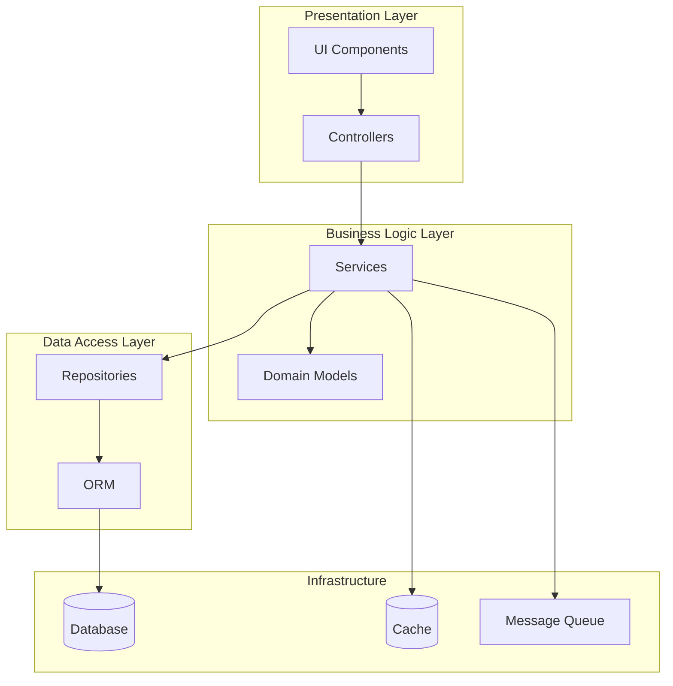
```mermaid
graph TB
    subgraph "Presentation Layer"
        UI[UI Components]
        Controller[Controllers]
    end

    subgraph "Business Logic Layer"
        Service[Services]
        Domain[Domain Models]
    end

    subgraph "Data Access Layer"
        Repository[Repositories]
        ORM[ORM]
    end

    subgraph "Infrastructure"
        DB[(Database)]
        Cache[(Cache)]
        Queue[Message Queue]
    end

    UI --> Controller
    Controller --> Service
    Service --> Domain
    Service --> Repository
    Repository --> ORM
    ORM --> DB
    Service --> Cache
    Service --> Queue
```

### Microservices Architecture
```mermaid
graph TB
    Client[Client Application]
    Gateway[API Gateway]

    subgraph "Service A"
        SA[Service A]
        DBA[(Database A)]
    end

    subgraph "Service B"
        SB[Service B]
        DBB[(Database B)]
    end

    subgraph "Service C"
        SC[Service C]
        DBC[(Database C)]
    end

    MQ[Message Queue]
    Cache[(Shared Cache)]

    Client --> Gateway
    Gateway --> SA
    Gateway --> SB
    Gateway --> SC

    SA --> DBA
    SB --> DBB
    SC --> DBC

    SA --> MQ
    SB --> MQ
    SC --> MQ

    SA --> Cache
    SB --> Cache
    SC --> Cache
```

### Data Pipeline
```mermaid
graph LR
    Source1[Data Source 1] --> Ingest[Data Ingestion]
    Source2[Data Source 2] --> Ingest
    Source3[Data Source 3] --> Ingest

    Ingest --> Raw[(Raw Data Storage)]
    Raw --> ETL[ETL Process]
    ETL --> Clean[(Cleaned Data)]
    Clean --> Analytics[Analytics Engine]
    Analytics --> DW[(Data Warehouse)]
    DW --> BI[BI Dashboard]
    DW --> ML[ML Models]
```

---

## Tips for Effective Diagrams

### 1. Choose the Right Diagram Type
- **Flowchart**: Algorithm logic, process flows
- **Sequence**: Request-response patterns, interactions between components
- **Class**: Object-oriented structure, design patterns
- **State**: Object lifecycles, connection states
- **ER**: Database schemas, data relationships
- **Graph**: System architecture, component relationships

### 2. Keep Diagrams Focused
- One main concept per diagram
- Maximum 7-10 nodes for clarity
- Split complex diagrams into multiple views

### 3. Use Consistent Naming
- CamelCase for classes
- snake_case for functions/variables
- UPPER_CASE for constants
- Descriptive labels for relationships

### 4. Add Context
- Include notes for complex logic
- Show error paths in flowcharts
- Indicate cardinality in relationships
- Label transition conditions

### 5. Maintain Visual Hierarchy
- Group related elements with subgraphs
- Use consistent arrow directions (top-to-bottom, left-to-right)
- Highlight critical paths or components
- Keep similar elements at the same level
