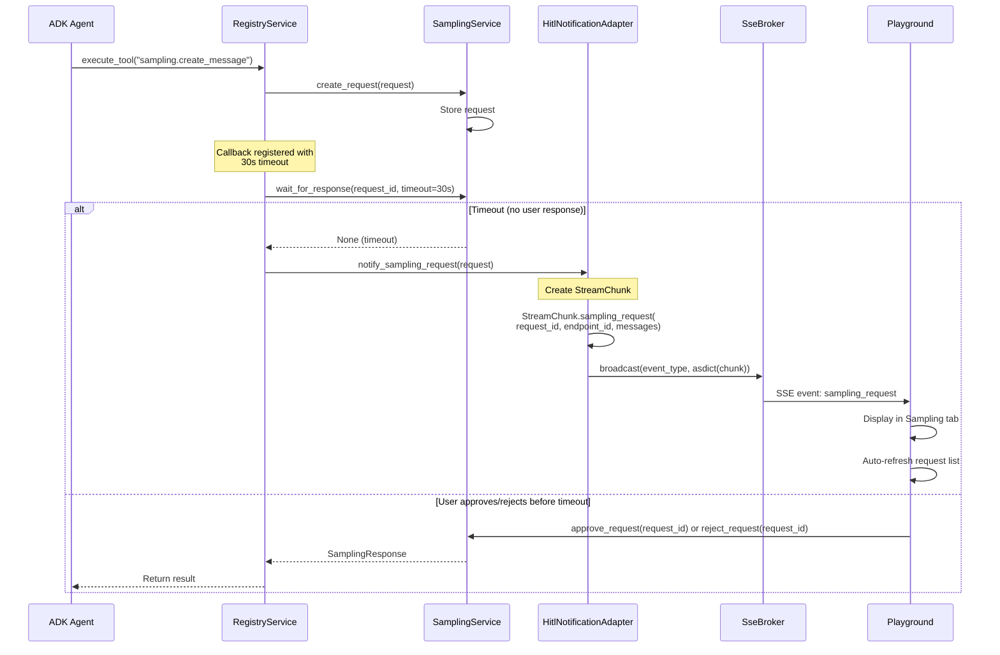
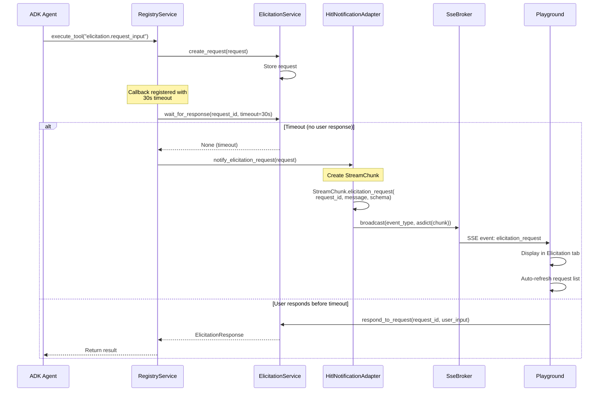

# SSE Event Flow

HITL (Human-In-The-Loop) SSE 이벤트 플로우를 설명합니다.

**Plan 07 Phase 7**에서 StreamChunk 기반으로 확장되었습니다.

---

## Overview

HITL SSE는 Sampling/Elicitation 요청이 timeout될 때 Extension/Playground에 실시간 알림을 전송하는 이벤트 스트림입니다.

**핵심 플로우:**
```
MCP Sampling/Elicitation 요청
  → 30초 timeout 대기
  → StreamChunk 팩토리 메서드로 이벤트 생성
  → SSE 브로드캐스트
  → Playground/Extension 수신
  → 사용자 승인/거부 또는 입력 제공
```

---

## Event Flow Diagram

### 1. Sampling Request Flow (MCP Sampling)



### 2. Elicitation Request Flow (MCP Elicitation)



---

## Component Responsibilities

### 1. Domain Services (RegistryService, SamplingService, ElicitationService)

**RegistryService Callback:**
- MCP Sampling/Elicitation 도구 실행 시 콜백 등록
- `wait_for_response(request_id, timeout=30.0)` 호출
- Timeout 발생 시 HitlNotificationAdapter 호출

**Code Example:**
```python
# src/domain/services/registry_service.py

# Sampling Callback
result = await self._sampling_service.wait_for_response(request_id, timeout=30.0)

if result is None:  # Timeout
    if self._hitl_notification:
        await self._hitl_notification.notify_sampling_request(request)
```

### 2. HitlNotificationAdapter (Outbound Adapter)

**Responsibility:**
- StreamChunk 팩토리 메서드로 이벤트 생성
- `asdict()` 변환 후 SSE 브로드캐스트

**Code Example:**
```python
# src/adapters/outbound/sse/hitl_notification_adapter.py

async def notify_sampling_request(self, request: SamplingRequest) -> None:
    chunk = StreamChunk.sampling_request(
        request_id=request.id,
        endpoint_id=request.endpoint_id,
        messages=request.messages,
    )
    await self._broker.broadcast(
        event_type=chunk.type,  # "sampling_request"
        data=asdict(chunk),      # StreamChunk → dict
    )
```

### 3. SseBroker (Pub/Sub Infrastructure)

**Responsibility:**
- asyncio.Queue 기반 pub/sub 패턴
- 모든 구독자에게 이벤트 브로드캐스트
- 구독자별 독립 큐 관리 (maxsize=100)

**Event Format:**
```python
{
    "type": "sampling_request",  # event_type
    "data": {                     # asdict(chunk)
        "type": "sampling_request",
        "content": "req-abc123",
        "agent_name": "test-endpoint",
        "tool_arguments": {"messages": [...]},
        "result": "",
        ...
    }
}
```

### 4. HTTP Route (/api/hitl/events)

**Responsibility:**
- SSE 연결 수락
- SseBroker 구독
- SSE 형식으로 이벤트 스트림 생성

**Code Example:**
```python
# src/adapters/inbound/http/routes/hitl_events.py

async def event_generator():
    yield ": ping\n\n"  # Keep-alive

    async for event in sse_broker.subscribe():
        event_type = event["type"]
        data = event["data"]
        yield f"event: {event_type}\n"
        yield f"data: {json.dumps(data)}\n\n"

return StreamingResponse(event_generator(), media_type="text/event-stream")
```

### 5. Playground (Frontend)

**Responsibility:**
- EventSource로 SSE 연결
- 이벤트 수신 시 UI 업데이트
- 자동 새로고침 (Sampling/Elicitation 탭)

**Code Example:**
```javascript
// tests/manual/playground/js/main.js

eventSource.addEventListener('sampling_request', (event) => {
    const data = JSON.parse(event.data);
    console.log('Sampling Request:', data);

    // Auto-refresh Sampling tab
    if (currentTab === 'sampling') {
        refreshSamplingList();
    }
});
```

---

## StreamChunk Field Mapping

Phase 7에서 StreamChunk 팩토리 메서드를 도입하여 일관된 이벤트 구조를 보장합니다.

| Event Type | StreamChunk Field | Value | Purpose |
|------------|-------------------|-------|---------|
| **sampling_request** | `type` | `"sampling_request"` | Event type identifier |
|  | `content` | request_id | Unique request identifier |
|  | `agent_name` | endpoint_id | MCP Server endpoint ID |
|  | `tool_arguments` | `{"messages": [...]}` | MCP Sampling messages |
| **elicitation_request** | `type` | `"elicitation_request"` | Event type identifier |
|  | `content` | request_id | Unique request identifier |
|  | `result` | message | User-facing prompt message |
|  | `tool_arguments` | `{"schema": {...}}` | JSON Schema for user input |

**Unused Fields:**
- `tool_name`, `error_code`, `workflow_*` 필드는 빈 값 (미래 확장 가능성 고려)

---

## Timeline Example

**Sampling Request 전체 시나리오:**

```
T=0s    : ADK Agent가 MCP Sampling 도구 호출
T=0s    : SamplingService가 요청 저장
T=0-30s : wait_for_response(timeout=30s) 대기
T=15s   : (선택 1) 사용자가 Playground에서 승인 → 즉시 응답 반환 ✅
T=30s   : (선택 2) Timeout 발생 → SSE 알림 전송
T=30s   : Playground가 SSE 이벤트 수신
T=30s   : Playground Sampling 탭 자동 새로고침
T=31s   : 사용자가 Playground에서 요청 확인 후 승인
T=31s   : 다음 wait_for_response() 호출 시 결과 반환 ✅
```

---

## Error Handling

### 1. SSE Connection Errors

| Error | Cause | Recovery |
|-------|-------|----------|
| `401 Unauthorized` | Invalid token | 재로그인 후 재연결 |
| `Connection timeout` | Network issue | Exponential backoff 재연결 |
| `Connection closed` | Server restart | 자동 재연결 (EventSource 기본 동작) |

### 2. Timeout Handling

- **Short timeout (30초)**: 사용자 응답 대기 (빠른 피드백)
- **Long timeout (300초)**: SSE 알림 후 재대기 (사용자 확인 시간 제공)
- **최종 실패**: Timeout 에러 반환 (ADK Agent가 fallback 처리)

### 3. Race Condition Prevention

- **asyncio.Lock**: SseBroker 구독/구독 해제 시 동기화
- **Request ID**: 고유 식별자로 중복 요청 방지
- **Idempotent API**: 동일 요청 ID로 재승인 시 동일 결과 반환

---

## Performance Considerations

### 1. SSE Connection Pool

- **Browser Limit**: HTTP/1.1에서 도메인당 최대 6개 연결
- **Mitigation**: HTTP/2 사용 또는 단일 SSE 연결로 모든 이벤트 전송

### 2. Queue Memory

- **Queue Size**: 구독자별 maxsize=100
- **Overflow**: 오래된 이벤트 자동 삭제 (FIFO)
- **Cleanup**: 구독 종료 시 큐 자동 제거

### 3. Timeout Optimization

- **Initial Timeout**: 30초 (빠른 피드백)
- **SSE Notification**: 즉시 (0ms)
- **Total Wait**: 최대 330초 (30s + 300s)

---

## Testing Strategy

### Unit Tests

```python
# tests/unit/domain/entities/test_stream_chunk.py
def test_sampling_request_chunk_creation():
    chunk = StreamChunk.sampling_request(
        request_id="req-123",
        endpoint_id="mcp-server-1",
        messages=[{"role": "user", "content": "test"}],
    )
    assert chunk.type == "sampling_request"
    assert chunk.content == "req-123"
```

### Integration Tests

```python
# tests/integration/test_hitl_notification_adapter.py
async def test_notify_sampling_request_broadcasts(adapter, fake_sse_broker):
    request = SamplingRequest(id="req-1", ...)
    await adapter.notify_sampling_request(request)

    event = fake_sse_broker.broadcasted_events[0]
    assert event["type"] == "sampling_request"
    assert event["data"]["content"] == "req-1"
```

### E2E Tests

```python
# tests/e2e/test_playground.py
async def test_sampling_request_sse_logged(page):
    # Trigger timeout
    await trigger_sampling_request()

    # Verify SSE log
    await page.wait_for_selector('[data-testid="sse-log"]')
    log_content = await page.locator('[data-testid="sse-log"]').text_content()
    assert "SAMPLING REQUEST" in log_content
```

---

## Related Documentation

- [HITL SSE Events API](../../architecture/api/hitl-sse.md) - API 명세 및 이벤트 스키마
- [Method C Signal Pattern](../../architecture/layer/patterns/method-c-signal.md) - Callback-centric LLM 배치
- [StreamChunk Entity](../../architecture/domain/entities.md#streamchunk) - Domain 엔티티 설계
- [SSE Broker Implementation](../../../../src/adapters/outbound/sse/README.md) - Pub/Sub 아키텍처
- [Playground Testing Guide](../../../../tests/manual/playground/README.md) - Playground UI 사용법

---

*Last Updated: 2026-02-08*
*Phase: Plan 07 Phase 7*
