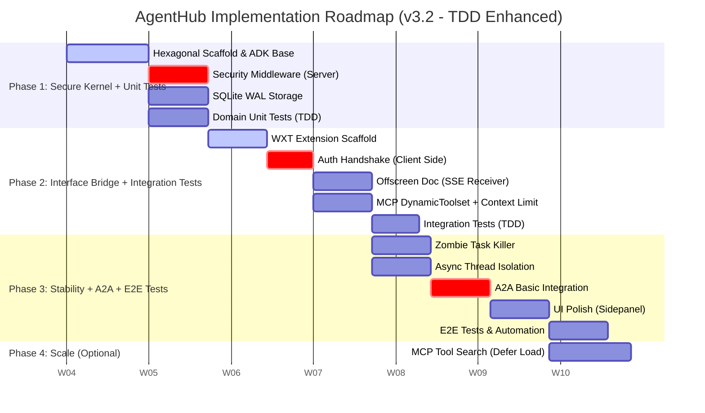

# AgentHub Implementation Roadmap v3.2

> TDD 강화, A2A 기본 통합, Git/CI 워크플로우 반영

**작성일:** 2026-01-28
**버전:** 3.2

---

## 1. Project Context & Vision

* **Project:** AgentHub (Google ADK + MCP Integrated Local System)
* **Core Value:** 로컬 환경에서 구동되는 **보안이 내재화된 에이전트 게이트웨이**를 통해, 웹 브라우저(Chrome)와 로컬/원격 도구(MCP)를 매끄럽게 연결합니다.
* **Strategic Pivot (v3.2):**
  * **MCP First:** 생태계가 풍부한 MCP를 우선 통합하여 즉각적인 효용을 제공합니다.
  * **Extension Driven:** Chrome Extension(WXT)을 핵심 인터페이스로 격상합니다.
  * **Security Native:** Server-Extension 간 Zero-Trust 핸드셰이크를 구현합니다.
  * **TDD Enhanced:** 각 Phase별 테스트 전략을 명시하고, 헥사고날 아키텍처 장점을 활용합니다.
  * **A2A Basic:** Phase 3에서 A2A 기본 통합을 포함합니다.

---

## 2. Implementation Phases Overview



---

## 3. Detailed Phase Breakdown

### Phase 1: The Secure Kernel (Backend Core) + Unit Tests

**목표:** 외부 의존성이 격리된 헥사고날 백엔드 구축 및 서버 측 보안 체계 확립. TDD로 Domain Layer 검증.

#### 1.1 Project Scaffolding

* **Directory Structure:** `src/domain` (순수 로직), `src/adapters` (FastAPI, ADK), `src/config` 분리
* **Environment:** pydantic-settings 기반 설정 관리 (API Keys, DB Path)
* **ADK Base:** LlmAgent와 LiteLLM을 래핑하는 AdkOrchestratorAdapter 기본 구조 구현

#### 1.2 Security Infrastructure (Server-Side)

* **Token Generation:** 서버 시작 시 `secrets.token_urlsafe(32)`로 일회성 토큰 생성
* **Auth Middleware:** 모든 `/api/*` 요청 헤더(X-Extension-Token) 검증 로직 구현
* **Token Endpoint:** `/auth/token` 구현 (CORS Origin 검증 포함, 1회 발급 제한)

#### 1.3 Storage Foundation

* **SQLite Setup:** aiosqlite 기반 비동기 연결
* **Concurrency:** `PRAGMA journal_mode=WAL` 설정 및 `asyncio.Lock`을 통한 쓰기 직렬화
* **Schema:** conversations, messages 테이블 DDL 작성

#### 1.4 Unit Tests (TDD)

* **Domain Entities:** Agent, Tool, Endpoint, Conversation 테스트
* **Domain Services:** Fake Adapter 기반 OrchestratorService, RegistryService 테스트
* **Target Coverage:** 80% 이상

**에이전트 활용:**
- `tdd-orchestrator`: Red-Green-Refactor 사이클 강제
- `security-auditor`: 보안 미들웨어 로직 검증

**✅ DoD (Definition of Done):**

* [ ] curl 명령어로 토큰 없이 API 호출 시 403 Forbidden 반환
* [ ] `/auth/token` 호출 시 유효한 토큰 반환 확인
* [ ] SQLite 파일에 WAL(-wal, -shm) 파일 생성 확인
* [ ] Domain 테스트 커버리지 80% 이상
* [ ] Fake Adapter 기반 테스트 통과

---

### Phase 2: The Interface Bridge (Extension & MCP Integration) + Integration Tests

**목표:** Chrome Extension과 서버를 연결하고, 기본 MCP 도구를 브라우저에서 호출. **(가장 중요한 Phase)**

#### 2.1 WXT Extension Backbone

* **Setup:** WXT + React + TypeScript 프로젝트 초기화
* **Manifest V3:** host_permissions (localhost), offscreen, sidePanel 권한 설정
* **Offscreen Document:** Service Worker 타임아웃 회피를 위한 SSE 수신 전용 HTML/TS 구현

#### 2.2 Auth Handshake (Client-Side)

* **Background Script:** onStartup 시 서버 `/auth/token` 호출하여 토큰 획득
* **Secure Storage:** 획득한 토큰을 `chrome.storage.session`에 저장 (디스크 저장 금지)
* **API Client:** 모든 fetch 요청에 토큰 헤더 자동 주입 로직 구현

#### 2.3 MCP DynamicToolset + Context Limit

* **Basic Toolset:** ADK BaseToolset을 상속받는 DynamicToolset 구현
* **Connection:** Streamable HTTP 클라이언트 구현 (ADK McpToolset 활용)
* **Context Explosion 방지:**
  * `MAX_ACTIVE_TOOLS = 30` (도구 개수 제한)
  * `TOOL_TOKEN_WARNING_THRESHOLD = 10000` (토큰 경고)
* **Testing:** filesystem 또는 memory MCP 서버 연결 테스트

#### 2.4 Chat Integration

* **Endpoint:** `/api/chat/stream` 구현 (LiteLLM + ADK 연결)
* **UI:** Sidepanel에 기본 채팅 인터페이스 구현 및 스트리밍 텍스트 렌더링

#### 2.5 Integration Tests (TDD)

* **ADK Orchestrator Adapter:** 실제 MCP 서버 연결 테스트
* **HTTP API:** FastAPI TestClient 기반 API 테스트
* **MCP Test Server:** `https://example-server.modelcontextprotocol.io/mcp` 활용

**에이전트 활용:**
- `tdd-orchestrator`: MCP 연동 TDD
- `code-reviewer`: API 보안 검토

**✅ DoD (Definition of Done):**

* [ ] Extension 설치 시 서버와 자동으로 토큰 교환 성공 로그 확인
* [ ] Sidepanel에서 "Hello" 입력 시 Claude가 응답
* [ ] 기본 MCP 도구(예: 파일 읽기)를 Extension을 통해 실행 성공
* [ ] 도구 개수 30개 초과 시 에러 반환 확인
* [ ] MCP 테스트 서버 연결 성공
* [ ] API 엔드포인트 통합 테스트 통과

---

### Phase 3: Robustness, A2A & E2E Tests (Stability)

**목표:** 장시간 작업 처리, 다중 도구 안정성 확보, A2A 기본 통합.

#### 3.1 Zombie Task Killer

* **Detection:** SSE 연결 끊김(`Request.is_disconnected()`) 감지
* **Action:** 연결 해제 시 실행 중인 `asyncio.Task`를 즉시 `cancel()` 처리

#### 3.2 Async Performance

* **Thread Isolation:** 동기식 라이브러리를 사용하는 MCP 도구 실행 시 `asyncio.to_thread`로 래핑

#### 3.3 A2A Basic Integration

* **Agent Card:** A2A 스펙에 따른 Agent Card 생성 및 교환
* **Basic Protocol:** `to_a2a()` 어댑터를 통한 기본 A2A 서버 노출
* **Testing:** a2a-samples 활용한 연결 테스트

#### 3.4 UI Polish

* **Code Block:** 채팅 내 코드 블록 신택스 하이라이팅
* **Tool Logs:** 도구 실행 과정(입력/출력)을 UI에 아코디언 형태로 표시

#### 3.5 E2E Tests & Automation

* **Extension E2E:** Playwright 기반 Extension 테스트
* **Full Flow:** Extension → Server → MCP/A2A 전체 흐름 테스트

**에이전트 활용:**
- `test-automator`: E2E 자동화 구축
- `code-reviewer`: 최종 품질 검토

**✅ DoD (Definition of Done):**

* [ ] 긴 답변 생성 중 브라우저 탭 닫기 시 서버 로그에 "Task Cancelled" 기록
* [ ] 무거운 연산 도구 실행 중에도 `/health` 엔드포인트가 즉시 응답
* [ ] A2A 기본 Agent Card 교환 성공
* [ ] Extension E2E 시나리오 통과

---

### Phase 4: Advanced Features (Future Scale) - Optional

**목표:** 대규모 도구 지원 및 확장 (시장 상황에 따라 변동 가능).

#### 4.1 Scalable Tool Management

* **Defer Loading:** 도구 개수가 많을 경우(>50개), 초기에는 메타데이터만 로드
* **Vector Search:** 도구 설명 임베딩을 통한 시맨틱 라우팅

---

## 4. Test Strategy (TDD + Hexagonal)

### 테스트 피라미드

```
                    ┌─────────┐
      Phase 3 ────► │   E2E   │  Extension + Server
                    └────┬────┘
                         │
              ┌──────────┴──────────┐
   Phase 2 ─► │    Integration      │  Adapter + External
              └──────────┬──────────┘
                         │
        ┌────────────────┴────────────────┐
Phase 1 │            Unit                 │  Domain Only
        │   (Fake Adapters, No Mocking)   │
        └─────────────────────────────────┘
```

### Phase별 테스트 전략

| Phase | 테스트 유형 | 대상 | 에이전트 | 커버리지 |
|-------|-----------|------|---------|---------|
| 1 | Unit | Domain Layer | tdd-orchestrator, security-auditor | 80% |
| 2 | Integration | Adapter Layer | tdd-orchestrator, code-reviewer | 70% |
| 3 | E2E | Full Stack | test-automator, code-reviewer | Critical Path |

### 헥사고날 아키텍처의 테스트 장점

- **Domain Layer:** Fake Adapter 사용으로 외부 의존성 없이 테스트
- **Adapter Layer:** Port 인터페이스 기반 테스트 격리
- **No Mocking:** 실제 구현체 또는 Fake Adapter 사용

---

## 5. Development Workflow

### CI/CD Pipeline (GitHub Actions)

```yaml
# .github/workflows/ci.yml (예시)
on: [push, pull_request]
jobs:
  backend:
    runs-on: ubuntu-latest
    steps:
      - uses: actions/checkout@v4
      - uses: actions/setup-python@v5
      - run: pip install -e ".[dev]"
      - run: pytest --cov=src

  extension:
    runs-on: ubuntu-latest
    steps:
      - uses: actions/checkout@v4
      - uses: actions/setup-node@v4
      - run: cd extension && npm ci && npm run build
```

### Claude Code Hooks (권장)

```json
// .claude/hooks.json
{
  "PostToolUse": {
    "Edit": "ruff format {file}",
    "Write": "ruff format {file}"
  }
}
```

### 브랜치 전략

추후 결정 예정. 권장: Trunk-Based Development (MVP/소규모 팀에 적합)

---

## 6. Immediate Next Actions (Checklist)

1. **Repository Setup:**
   * [ ] `src/` (Backend)와 `extension/` (Frontend) 디렉토리 생성
   * [ ] `.gitignore` 및 `README.md` 업데이트
   * [ ] `.github/workflows/ci.yml` 생성

2. **Run Initialization Scripts:**
   * [ ] `python -m venv .venv`
   * [ ] `cd extension && npm install`

3. **Execute Phase 1:** `src/adapters/inbound/http/security.py` 작성부터 시작

---

## 7. Related Documents

| 문서 | 내용 |
|------|------|
| @docs/architecture.md | 헥사고날 아키텍처 설계 |
| @docs/implementation-guide.md | 구현 패턴 및 코드 예시 |
| @docs/extension-guide.md | Chrome Extension 개발 가이드 |
| @docs/risk-assessment.md | 리스크 평가 및 완화 전략 |

---

## 8. References

- [Google ADK 1.23.0 Release](https://github.com/google/adk-python/releases/tag/v1.23.0)
- [MCP Streamable HTTP Transport](https://modelcontextprotocol.io/specification/2025-03-26/basic/transports)
- [WXT Framework](https://wxt.dev/)
- [Claude Code Hooks](https://blog.gitbutler.com/automate-your-ai-workflows-with-claude-code-hooks)
- [Trunk-Based Development](https://trunkbaseddevelopment.com/)

---

*문서 생성일: 2026-01-28*
