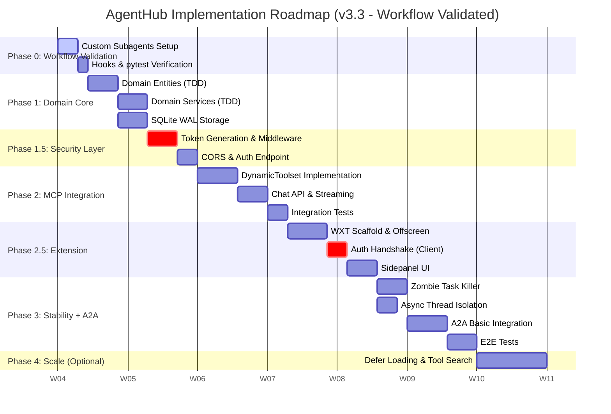

# AgentHub Implementation Roadmap v3.3

> TDD 강화, 워크플로우 검증, Phase 세분화, Claude Code 연동 최적화

**작성일:** 2026-01-28
**버전:** 3.3

---

## 1. Project Context & Vision

* **Project:** AgentHub (Google ADK + MCP Integrated Local System)
* **Core Value:** 로컬 환경에서 구동되는 **보안이 내재화된 에이전트 게이트웨이**를 통해, 웹 브라우저(Chrome)와 로컬/원격 도구(MCP)를 매끄럽게 연결합니다.
* **Strategic Pivot (v3.3):**
  * **Workflow Validated:** 구현 전 Claude Code 워크플로우(서브에이전트, Hooks, 테스트) 사전 검증
  * **MCP First:** 생태계가 풍부한 MCP를 우선 통합하여 즉각적인 효용을 제공합니다.
  * **Extension Driven:** Chrome Extension(WXT)을 핵심 인터페이스로 격상합니다.
  * **Security Native:** Server-Extension 간 Zero-Trust 핸드셰이크를 구현합니다.
  * **TDD Enhanced:** 각 Phase별 테스트 전략을 명시하고, 헥사고날 아키텍처 장점을 활용합니다.
  * **A2A Basic:** Phase 3에서 A2A 기본 통합을 포함합니다.

---

## 2. Implementation Phases Overview



---

## 3. Detailed Phase Breakdown

### Phase 0: Workflow Validation Sprint

**목표:** Claude Code 워크플로우가 프로젝트 요구사항에 맞게 동작하는지 사전 검증. 실패 시 본 개발 진행 불가.

#### 0.1 Custom Subagents Setup

`.claude/agents/` 폴더에 프로젝트 전용 서브에이전트 정의:

| 에이전트 | 파일명 | 역할 | 도구 |
|---------|--------|------|------|
| TDD Agent | `tdd-agent.md` | Red-Green-Refactor 사이클 강제 | Read, Write, Edit, Bash, Glob, Grep |
| Security Reviewer | `security-reviewer.md` | 보안 취약점 검토 | Read, Grep, Glob, WebSearch |
| Code Reviewer | `code-reviewer.md` | 코드 품질 및 아키텍처 검토 | Read, Grep, Glob |

#### 0.2 Hooks Configuration

`.claude/settings.json`에 Hooks 설정:

```json
{
  "hooks": {
    "Stop": [{
      "matcher": "",
      "hooks": [{
        "type": "command",
        "command": "ruff check src/ --fix --quiet && ruff format src/ --quiet"
      }]
    }],
    "PreToolUse": [{
      "matcher": "Edit|Write",
      "hooks": [{
        "type": "command",
        "command": "[ \"$(git branch --show-current)\" != \"main\" ] || { echo 'Direct commits to main blocked' >&2; exit 2; }"
      }]
    }]
  }
}
```

#### 0.3 pytest Environment Verification

```bash
# 가상환경 및 pytest 설치 확인
python -m venv .venv
source .venv/bin/activate  # Windows: .venv\Scripts\activate
pip install pytest pytest-cov pytest-asyncio ruff
pytest --version
```

**✅ DoD (Definition of Done):**

* [ ] `/agents` 명령으로 커스텀 서브에이전트 3개 확인
* [ ] Stop 훅 트리거 시 ruff 실행 확인
* [ ] PreToolUse 훅으로 main 브랜치 보호 확인
* [ ] `pytest tests/ -v` 실행 성공 (빈 테스트라도)

---

### Phase 1: Domain Core (Backend Foundation)

**목표:** 헥사고날 아키텍처의 Domain Layer 구축. 순수 Python으로 외부 의존성 없이 테스트 가능한 코어 로직.

#### 1.1 Domain Entities (TDD)

* **Agent:** id, name, model, instruction
* **Tool:** name, description, input_schema, endpoint_id
* **Endpoint:** id, name, url, type(MCP/A2A), enabled, registered_at
* **Conversation:** id, title, messages[], created_at, updated_at
* **Message:** id, role, content, tool_calls[], created_at

#### 1.2 Domain Services (TDD)

* **OrchestratorService:** 메시지 처리, 스트리밍 응답 조율
* **RegistryService:** 엔드포인트 등록/해제/조회
* **ConversationService:** 대화 세션 관리, 메시지 저장/조회
* **HealthMonitorService:** 엔드포인트 상태 모니터링

#### 1.3 SQLite WAL Storage

* **Setup:** aiosqlite 기반 비동기 연결
* **Concurrency:** `PRAGMA journal_mode=WAL` + `asyncio.Lock` 쓰기 직렬화
* **Schema:** conversations, messages, tool_calls 테이블

#### 1.4 Port Interfaces

* **Inbound Ports:** ChatPort, ManagementPort
* **Outbound Ports:** OrchestratorPort, StoragePort, A2aPort

**서브에이전트 호출 시점:**
- 각 엔티티/서비스 구현 전: `tdd-agent` 호출하여 테스트 먼저 작성
- 구현 완료 후: `code-reviewer` 호출하여 헥사고날 원칙 준수 검토

**✅ DoD:**

* [ ] Domain Layer에 외부 라이브러리 import 없음 (ADK, FastAPI 등)
* [ ] 모든 엔티티/서비스에 대한 단위 테스트 존재
* [ ] Fake Adapter 기반 테스트 통과
* [ ] 테스트 커버리지 80% 이상
* [ ] SQLite WAL 모드 동작 확인 (-wal, -shm 파일 생성)

---

### Phase 1.5: Security Layer

**목표:** Server-Extension 간 Zero-Trust 보안 체계 확립. Drive-by RCE 공격 방지.

#### 1.5.1 Token Generation

* 서버 시작 시 `secrets.token_urlsafe(32)`로 일회성 토큰 생성
* 토큰은 메모리에만 저장 (파일/DB 저장 금지)

#### 1.5.2 Auth Middleware

* 모든 `/api/*` 요청에 `X-Extension-Token` 헤더 검증
* 토큰 불일치 시 403 Forbidden 반환

#### 1.5.3 Token Exchange Endpoint

* `POST /auth/token`: Extension ID 검증 후 토큰 반환
* CORS Origin 검증: `chrome-extension://` 만 허용
* 토큰 발급 횟수 제한 (선택적)

#### 1.5.4 CORS Configuration

```python
app.add_middleware(
    CORSMiddleware,
    allow_origins=["chrome-extension://*"],
    allow_methods=["GET", "POST", "DELETE"],
    allow_headers=["X-Extension-Token", "Content-Type"],
)
```

**서브에이전트 호출 시점:**
- 보안 미들웨어 구현 후: `security-reviewer` 호출하여 취약점 검토

**✅ DoD:**

* [ ] curl로 토큰 없이 `/api/*` 호출 시 403 반환
* [ ] `/auth/token` 호출 시 유효한 토큰 반환
* [ ] 잘못된 Origin에서 요청 시 CORS 에러

---

### Phase 2: MCP Integration (Backend API)

**목표:** MCP 서버 동적 연결 및 도구 호출 API 구현. **(핵심 기능)**

#### 2.1 DynamicToolset Implementation

* ADK `BaseToolset` 상속
* Streamable HTTP 우선, SSE fallback (레거시 서버용)
* TTL 기반 캐싱 (기본 5분)
* Context Explosion 방지:
  * `MAX_ACTIVE_TOOLS = 30`
  * `TOOL_TOKEN_WARNING_THRESHOLD = 10000`

#### 2.2 Chat API & Streaming

* `POST /api/chat/stream`: SSE 스트리밍 응답
* ADK `LlmAgent` + `LiteLlm` 연동
* Zombie Task 방지: `Request.is_disconnected()` 체크

#### 2.3 MCP Management API

* `POST /api/mcp/servers`: MCP 서버 등록
* `GET /api/mcp/servers`: 등록된 서버 목록
* `DELETE /api/mcp/servers/{id}`: 서버 해제
* `GET /api/mcp/servers/{id}/tools`: 도구 목록 조회

#### 2.4 Integration Tests

* FastAPI TestClient 기반 API 테스트
* MCP 테스트 서버: `https://example-server.modelcontextprotocol.io/mcp`

**서브에이전트 호출 시점:**
- DynamicToolset 구현 전: `tdd-agent` 호출
- API 구현 완료 후: `security-reviewer` 호출 (입력 검증, 에러 처리)

**✅ DoD:**

* [ ] MCP 테스트 서버 연결 성공
* [ ] 도구 목록 조회 API 동작
* [ ] 도구 개수 30개 초과 시 에러 반환
* [ ] SSE 스트리밍 응답 정상 동작
* [ ] 통합 테스트 커버리지 70% 이상

---

### Phase 2.5: Chrome Extension

**목표:** WXT 기반 Extension으로 서버와 연동. Offscreen Document로 장시간 요청 처리.

#### 2.5.1 WXT Scaffold

* WXT + React + TypeScript 초기화
* Manifest V3: `host_permissions`, `offscreen`, `sidePanel`, `storage` 권한

#### 2.5.2 Offscreen Document

* Service Worker 30초 타임아웃 회피
* SSE 스트리밍 수신 전용 문서
* Background ↔ Offscreen 메시지 라우팅

#### 2.5.3 Auth Handshake (Client)

* `onStartup` 시 `/auth/token` 호출
* `chrome.storage.session`에 토큰 저장
* 모든 API 요청에 `X-Extension-Token` 헤더 자동 주입

#### 2.5.4 Sidepanel UI

* 기본 채팅 인터페이스
* 스트리밍 텍스트 렌더링
* MCP 서버 관리 UI (등록/해제)

**✅ DoD:**

* [ ] Extension 설치 시 서버와 자동 토큰 교환 성공
* [ ] Sidepanel에서 "Hello" 입력 시 Claude 응답
* [ ] MCP 도구 호출 결과가 UI에 표시
* [ ] 브라우저 종료 후 재시작 시 토큰 재발급 정상 동작

---

### Phase 3: Stability & A2A Integration

**목표:** 장시간 작업 안정성 확보, A2A 기본 통합, E2E 테스트 자동화.

#### 3.1 Zombie Task Killer

* SSE 연결 끊김 감지: `Request.is_disconnected()`
* 연결 해제 시 `asyncio.Task.cancel()` 호출
* `asyncio.CancelledError` 명시적 처리

#### 3.2 Async Thread Isolation

* 동기식 MCP 도구 실행 시 `asyncio.to_thread()` 래핑
* 메인 이벤트 루프 블로킹 방지

#### 3.3 A2A Basic Integration

* Agent Card 생성 및 교환 (A2A 스펙 준수)
* `to_a2a()` 어댑터로 A2A 서버 노출
* a2a-samples 활용 연결 테스트

#### 3.4 UI Polish

* 코드 블록 신택스 하이라이팅
* 도구 실행 로그 아코디언 UI
* 에러 상태 표시 개선

#### 3.5 E2E Tests

* Playwright 기반 Extension E2E 테스트
* Full Flow: Extension → Server → MCP/A2A

**✅ DoD:**

* [ ] 긴 응답 생성 중 탭 닫기 시 서버 로그에 "Task Cancelled"
* [ ] 무거운 도구 실행 중에도 `/health` 즉시 응답
* [ ] A2A Agent Card 교환 성공
* [ ] E2E 시나리오 통과

---

### Phase 4: Advanced Features (Optional)

**목표:** 대규모 도구 지원. 시장 상황에 따라 변동 가능.

#### 4.1 Scalable Tool Management

* Defer Loading: 도구 50개 초과 시 메타데이터만 로드
* Vector Search: 도구 설명 임베딩 기반 시맨틱 라우팅

---

## 4. Test Strategy (TDD + Hexagonal)

### 테스트 피라미드

```
                    ┌─────────────┐
      Phase 3 ────► │    E2E      │  Extension + Server
                    └──────┬──────┘
                           │
                ┌──────────┴──────────┐
   Phase 2 ───► │    Integration      │  Adapter + External
                └──────────┬──────────┘
                           │
          ┌────────────────┴────────────────┐
 Phase 1  │             Unit                │  Domain Only
          │    (Fake Adapters, No Mocking)  │
          └─────────────────────────────────┘
```

### Phase별 테스트 전략

| Phase | 테스트 유형 | 대상 | 서브에이전트 | 커버리지 목표 |
|-------|-----------|------|-------------|--------------|
| 1 | Unit | Domain Layer | tdd-agent | 80% |
| 1.5 | Unit | Security Middleware | security-reviewer | - |
| 2 | Integration | MCP Adapter, API | tdd-agent | 70% |
| 2.5 | Integration | Extension ↔ Server | - | - |
| 3 | E2E | Full Stack | code-reviewer | Critical Path |

### 헥사고날 아키텍처 테스트 장점

- **Domain Layer:** Fake Adapter로 외부 의존성 없이 테스트
- **Adapter Layer:** Port 인터페이스 기반 테스트 격리
- **No Mocking:** 실제 구현체 또는 Fake Adapter 사용

---

## 5. Claude Code Integration Guide

### 5.1 Custom Subagents

`.claude/agents/` 폴더에 마크다운 파일로 정의:

```yaml
# .claude/agents/tdd-agent.md
---
name: tdd-agent
description: TDD Red-Green-Refactor 사이클을 강제. 테스트 작성 요청 시 자동 호출.
tools: Read, Write, Edit, Bash, Glob, Grep
model: sonnet
---

# TDD Agent

You enforce strict Test-Driven Development:

1. **Red**: Write failing test FIRST
2. **Green**: Write minimal code to pass
3. **Refactor**: Improve while keeping tests green

NEVER write implementation before tests exist.
```

### 5.2 Subagent 호출 시점

| 작업 | 호출할 서브에이전트 | 시점 |
|------|-------------------|------|
| 새 엔티티/서비스 구현 | `tdd-agent` | 구현 전 (테스트 먼저) |
| 보안 관련 코드 | `security-reviewer` | 구현 후 검토 |
| PR 전 최종 검토 | `code-reviewer` | 코드 완성 후 |

### 5.3 Hooks 정책

| Phase | Hooks 설정 | 이유 |
|-------|-----------|------|
| 0-2.5 | Stop 훅만 (포맷팅) | 개발 속도 우선, 컨텍스트 절약 |
| 3+ | 전체 활성화 | 안정화 단계, 품질 강제 |

**Stop 훅 선택 이유:**
- PostToolUse는 매 Edit/Write마다 실행 → 컨텍스트 낭비
- Stop 훅은 응답 완료 후 1회만 실행 → 효율적

### 5.4 TDD 워크플로우

```
1. Human: 요구사항 정의
2. tdd-agent: 테스트 코드 생성 (Red)
3. Claude: 구현 코드 생성 (Green)
4. Human: 검토 및 승인
5. Claude: 리팩토링 (Refactor)
6. Stop Hook: ruff 포맷팅
```

---

## 6. Development Workflow

### Hooks 설정 (권장)

```json
// .claude/settings.json
{
  "hooks": {
    "Stop": [{
      "matcher": "",
      "hooks": [{
        "type": "command",
        "command": "ruff check src/ --fix --quiet && ruff format src/ --quiet"
      }]
    }],
    "PreToolUse": [{
      "matcher": "Edit|Write",
      "hooks": [{
        "type": "command",
        "command": "[ \"$(git branch --show-current)\" != \"main\" ] || exit 2"
      }]
    }]
  }
}
```

### 브랜치 전략

Trunk-Based Development 권장 (MVP/소규모 팀에 적합)

---

## 7. Immediate Next Actions (Checklist)

> **범례:** ✅ 완료 | 🤖 자동화됨 | 👤 수동 실행 필요

### Phase 0 준비

| 상태 | 항목 | 유형 |
|:---:|------|:---:|
| ✅ | `.claude/agents/` 폴더 생성 | - |
| ✅ | `tdd-agent.md`, `security-reviewer.md`, `code-reviewer.md` 작성 | - |
| ✅ | `hexagonal-architect.md` 작성 | - |
| ✅ | `.claude/settings.json` 생성 (Hooks 설정) | - |
| ✅ | `tests/unit/`, `tests/integration/`, `tests/e2e/` 폴더 생성 | - |
| ✅ | `docs/decisions/` ADR 폴더 생성 | - |
| ✅ | `.github/workflows/ci.yml` 생성 | - |

### 개발 환경 (👤 수동 실행 필요)

| 상태 | 항목 | 유형 |
|:---:|------|:---:|
| [ ] | `python -m venv .venv && pip install -e ".[dev]"` | 👤 수동 |
| [ ] | `cd extension && npm install` | 👤 수동 |
| [ ] | `pytest --version` 확인 | 👤 수동 |

### 디렉토리 구조 (Phase 1 시작 시 생성)

| 상태 | 항목 | 유형 |
|:---:|------|:---:|
| [ ] | `src/domain/entities/`, `src/domain/services/`, `src/domain/ports/` 생성 | 🤖 구현 시 |
| [ ] | `src/adapters/inbound/`, `src/adapters/outbound/` 생성 | 🤖 구현 시 |

### 커스텀 에이전트 생성 계획

| Phase | 에이전트 | 역할 | 상태 |
|:-----:|---------|------|:---:|
| Phase 1 | `hexagonal-architect` | 헥사고날 아키텍처 검토 | ✅ 완료 |
| Phase 2 | `adk-specialist` | Google ADK, LiteLLM, MCP 전문 | 📋 예정 |
| Phase 2.5 | `extension-specialist` | WXT, Chrome Extension 전문 | 📋 예정 |

---

## 8. Related Documents

| 문서 | 내용 |
|------|------|
| [architecture.md](architecture.md) | 헥사고날 아키텍처 설계 |
| [implementation-guide.md](implementation-guide.md) | 구현 패턴 및 코드 예시 |
| [extension-guide.md](extension-guide.md) | Chrome Extension 개발 가이드 |
| [risk-assessment.md](risk-assessment.md) | 리스크 평가 및 완화 전략 |

---

## 9. References

- [Claude Code Custom Subagents](https://code.claude.com/docs/en/sub-agents)
- [Claude Code Hooks Guide](https://docs.claude.com/en/docs/claude-code/hooks)
- [Google ADK Documentation](https://google.github.io/adk-docs/)
- [MCP Specification (2025-11-25)](https://modelcontextprotocol.io/specification/2025-11-25)
- [WXT Framework](https://wxt.dev/)
- [TDD with AI - Builder.io](https://www.builder.io/blog/test-driven-development-ai)

---

*문서 생성일: 2026-01-28*
