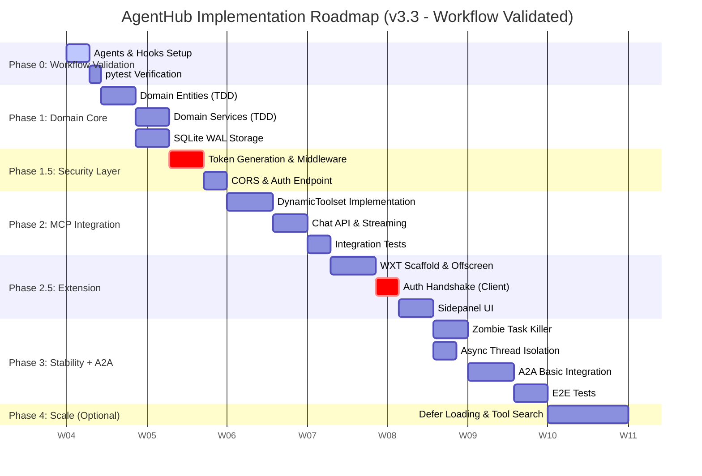

# AgentHub Implementation Roadmap v3.3

> TDD 강화, 워크플로우 검증, Phase 세분화, Claude Code 연동 최적화

**작성일:** 2026-01-28
**버전:** 3.3

---

## 1. Project Context & Vision

* **Project:** AgentHub (Google ADK + MCP Integrated Local System)
* **Core Value:** 로컬 환경에서 구동되는 **보안이 내재화된 에이전트 게이트웨이**를 통해, 웹 브라우저(Chrome)와 로컬/원격 도구(MCP)를 매끄럽게 연결합니다.
* **Strategic Pivot (v3.3):**
  * **Workflow Validated:** 구현 전 Claude Code 워크플로우(Hooks, 테스트) 사전 검증
  * **MCP First:** 생태계가 풍부한 MCP를 우선 통합하여 즉각적인 효용을 제공합니다.
  * **Extension Driven:** Chrome Extension(WXT)을 핵심 인터페이스로 격상합니다.
  * **Security Native:** Server-Extension 간 Zero-Trust 핸드셰이크를 구현합니다.
  * **TDD Enhanced:** 각 Phase별 테스트 전략을 명시하고, 헥사고날 아키텍처 장점을 활용합니다.
  * **A2A Basic:** Phase 3에서 A2A 기본 통합을 포함합니다.

---

## 2. Phase별 상세 플랜

각 Phase의 구체적인 구현 계획은 별도 플랜 문서로 관리됩니다:

| Phase | 플랜 문서 | 상태 |
|-------|----------|:---:|
| Phase 0 | 본 문서 참조 | ✅ 완료 |
| Phase 1 | [phase1.0.md](plans/phase1.0.md) | ✅ 완료 |
| Phase 1.5 | [phase1.5.md](plans/phase1.5.md) | ✅ 완료 |
| Phase 2 | [phase2.0.md](plans/phase2.0.md) | ✅ 완료 |
| Phase 2.5 | [phase2.5.md](plans/phase2.5.md) | ✅ 완료 (수동 검증 대기) |
| Phase 3 | [phase3.0.md](plans/phase3.0.md) | 📋 예정 |
| Phase 4 | [phase4.0.md](plans/phase4.0.md) | 📋 예정 |

**플랜 문서 구성:**
- 구현 전략 및 기술적 고려사항
- 단계별 구현 순서 (Step-by-Step)
- 테스트 전략 및 DoD (Definition of Done)
- 리스크 및 주의사항

---

## 3. Implementation Phases Overview



---

## 4. Detailed Phase Breakdown

### Phase 0: Workflow Validation Sprint

**목표:** Claude Code 워크플로우가 프로젝트 요구사항에 맞게 동작하는지 사전 검증. 실패 시 본 개발 진행 불가.

#### 0.1 Agents & Hooks Setup

`.claude/agents/` 폴더에 프로젝트 전용 에이전트 정의:

| 에이전트 | 파일명 | 역할 |
|---------|--------|------|
| TDD Agent | `tdd-agent.md` | Red-Green-Refactor 사이클 강제 |
| Security Reviewer | `security-reviewer.md` | 보안 취약점 검토 |
| Code Reviewer | `code-reviewer.md` | 코드 품질 및 아키텍처 검토 |

#### 0.2 Hooks Configuration

`.claude/settings.json`에 Hooks 설정:

```json
{
  "hooks": {
    "Stop": [{
      "matcher": "",
      "hooks": [{
        "type": "command",
        "command": "ruff check src/ --fix --quiet && ruff format src/ --quiet"
      }]
    }],
    "PreToolUse": [{
      "matcher": "Edit|Write",
      "hooks": [{
        "type": "command",
        "command": "[ \"$(git branch --show-current)\" != \"main\" ] || { echo 'Direct commits to main blocked' >&2; exit 2; }"
      }]
    }]
  }
}
```

#### 0.3 pytest Environment Verification

```bash
# 가상환경 및 pytest 설치 확인
python -m venv .venv
source .venv/bin/activate  # Windows: .venv\Scripts\activate
pip install pytest pytest-cov pytest-asyncio ruff
pytest --version
```

**✅ DoD (Definition of Done):**

* [x] 커스텀 에이전트 4개 설정 완료 (tdd-agent, security-reviewer, code-reviewer, hexagonal-architect)
* [x] Stop 훅 트리거 시 ruff 실행 확인
* [x] PreToolUse 훅으로 main 브랜치 보호 확인
* [x] `pytest tests/ -v` 실행 성공 (136 tests passed)

---

### Phase 1: Domain Core (Backend Foundation)

**📋 상세 플랜:** [phase1.0.md](plans/phase1.0.md)

**목표:** 헥사고날 아키텍처의 Domain Layer 구축. 순수 Python으로 외부 의존성 없이 테스트 가능한 코어 로직.

#### 1.1 Domain Entities (TDD)

* **Agent:** id, name, model, instruction
* **Tool:** name, description, input_schema, endpoint_id
* **Endpoint:** id, name, url, type(MCP/A2A), enabled, registered_at
* **Conversation:** id, title, messages[], created_at, updated_at
* **Message:** id, role, content, tool_calls[], created_at

#### 1.2 Domain Services (TDD)

* **OrchestratorService:** 메시지 처리, 스트리밍 응답 조율
* **RegistryService:** 엔드포인트 등록/해제/조회
* **ConversationService:** 대화 세션 관리, 메시지 저장/조회
* **HealthMonitorService:** 엔드포인트 상태 모니터링

#### 1.3 SQLite WAL Storage

* **Setup:** aiosqlite 기반 비동기 연결
* **Concurrency:** `PRAGMA journal_mode=WAL` + `asyncio.Lock` 쓰기 직렬화
* **Schema:** conversations, messages, tool_calls 테이블

#### 1.4 Port Interfaces

* **Inbound Ports:** ChatPort, ManagementPort
* **Outbound Ports:** OrchestratorPort, StoragePort, A2aPort

**품질 검증:**
- 각 엔티티/서비스 구현 전: TDD 테스트 먼저 작성 필요
- 구현 완료 후: 헥사고날 원칙 준수 검토 필요

#### 1.5 Folder Documentation

**Phase 1 시작 시 생성:**
- `src/README.md`: 백엔드 전체 구조 개요, 헥사고날 아키텍처 레이어 간 관계 설명
- `tests/README.md`: 테스트 전략, 실행 방법, Fake Adapter 패턴 소개

**Phase 1 완료 시 생성:**
- `src/domain/README.md`: Domain Layer 설계 철학, 엔티티/서비스 목록, 외부 의존성 금지 원칙
- `src/config/README.md`: 설정 우선순위(환경변수 > .env > YAML), DI 컨테이너 사용법

**README 필수 구성:**
1. **Purpose**: 폴더의 역할
2. **Structure**: 하위 구조 설명
3. **Key Files**: 주요 파일 및 역할
4. **Usage**: 사용 방법 또는 참조 명령어
5. **References**: 관련 문서 링크 (architecture.md, implementation-guide.md 등)

**✅ DoD:**

* [x] Domain Layer에 외부 라이브러리 import 없음 (ADK, FastAPI 등)
* [x] 모든 엔티티/서비스에 대한 단위 테스트 존재
* [x] Fake Adapter 기반 테스트 통과
* [x] 테스트 커버리지 80% 이상 (달성: 90.84%)
* [x] SQLite WAL 모드 동작 확인 (통합 테스트 검증 완료)
* [x] 필수 README 파일 생성: `src/`, `src/domain/`, `src/config/`, `tests/`

---

### Phase 1.5: Security Layer

**📋 상세 플랜:** [phase1.5.md](plans/phase1.5.md)

**목표:** Server-Extension 간 Zero-Trust 보안 체계 확립. Drive-by RCE 공격 방지.

#### 1.5.1 Token Generation

* 서버 시작 시 `secrets.token_urlsafe(32)`로 일회성 토큰 생성
* 토큰은 메모리에만 저장 (파일/DB 저장 금지)

#### 1.5.2 Auth Middleware

* 모든 `/api/*` 요청에 `X-Extension-Token` 헤더 검증
* 토큰 불일치 시 403 Forbidden 반환

#### 1.5.3 Token Exchange Endpoint

* `POST /auth/token`: Extension ID 검증 후 토큰 반환
* CORS Origin 검증: `chrome-extension://` 만 허용
* 토큰 발급 횟수 제한 (선택적)

#### 1.5.4 CORS Configuration

```python
app.add_middleware(
    CORSMiddleware,
    allow_origins=["chrome-extension://*"],
    allow_methods=["GET", "POST", "DELETE"],
    allow_headers=["X-Extension-Token", "Content-Type"],
)
```

**품질 검증:**
- 보안 미들웨어 구현 후: 보안 취약점 검토 필요

#### 1.5.5 Documentation Update

**Phase 1.5 완료 시 업데이트:**
- `src/README.md`: 보안 레이어 추가
  - "Security" 섹션 추가: Token Handshake, CORS, Auth Middleware 설명
  - Drive-by RCE 방지 패턴 개요
  - 참조: [implementation-guide.md#9-보안-패턴](implementation-guide.md#9-보안-패턴)

**✅ DoD:**

* [x] curl로 토큰 없이 `/api/*` 호출 시 403 반환
* [x] `/auth/token` 호출 시 유효한 토큰 반환
* [x] 잘못된 Origin에서 요청 시 CORS 에러
* [x] `src/README.md`에 보안 섹션 추가

---

### Phase 2: MCP Integration (Backend API)

**📋 상세 플랜:** [phase2.0.md](plans/phase2.0.md) *(예정)*

**목표:** MCP 서버 동적 연결 및 도구 호출 API 구현. **(핵심 기능)**

#### 2.1 DynamicToolset Implementation

* ADK `BaseToolset` 상속
* Streamable HTTP 우선, SSE fallback (레거시 서버용)
* TTL 기반 캐싱 (기본 5분)
* Context Explosion 방지:
  * `MAX_ACTIVE_TOOLS = 30`
  * `TOOL_TOKEN_WARNING_THRESHOLD = 10000`

#### 2.2 Chat API & Streaming

* `POST /api/chat/stream`: SSE 스트리밍 응답
* ADK `LlmAgent` + `LiteLlm` 연동
* Zombie Task 방지: `Request.is_disconnected()` 체크

#### 2.3 MCP Management API

* `POST /api/mcp/servers`: MCP 서버 등록
* `GET /api/mcp/servers`: 등록된 서버 목록
* `DELETE /api/mcp/servers/{id}`: 서버 해제
* `GET /api/mcp/servers/{id}/tools`: 도구 목록 조회

#### 2.4 Integration Tests

* FastAPI TestClient 기반 API 테스트
* 로컬 MCP 서버: `http://127.0.0.1:9000/mcp` (Synapse, `SYNAPSE_PORT=9000 python -m synapse`)

**품질 검증:**
- DynamicToolset 구현 전: TDD 테스트 작성 필요
- API 구현 완료 후: 보안 검토 필요 (입력 검증, 에러 처리)

#### 2.5 Documentation

**Phase 2 완료 시 생성:**
- `src/adapters/README.md`: Adapter Layer 역할, Inbound/Outbound 구분, 주요 구현체 목록
  - 포함 내용: HTTP API, ADK Orchestrator, DynamicToolset, Storage Adapters 설명
  - 참조: [implementation-guide.md](implementation-guide.md#2-dynamictoolset-구현)

**Phase 2 완료 시 업데이트:**
- `src/README.md`: Adapters Layer 상세화
  - MCP 통합 아키텍처 추가 (DynamicToolset, LlmAgent 연동 설명)
  - API 엔드포인트 목록 추가 (/api/chat/stream, /api/mcp/servers 등)
  - 참조: [architecture.md#adapters-layer](architecture.md#2-adapters-layer-외부-연동)

**✅ DoD:**

* [x] 로컬 MCP 서버 연결 성공 (`http://127.0.0.1:9000/mcp`)
* [x] 도구 목록 조회 API 동작
* [x] 도구 개수 30개 초과 시 에러 반환 (MAX_ACTIVE_TOOLS=30)
* [x] SSE 스트리밍 응답 정상 동작
* [x] 통합 테스트 커버리지 88% (목표 70% 초과)
* [x] `src/adapters/README.md` 생성
* [x] `src/README.md` MCP 아키텍처 섹션 추가

---

### Phase 2.5: Chrome Extension

**📋 상세 플랜:** [phase2.5.md](plans/phase2.5.md) *(예정)*

**목표:** WXT 기반 Extension으로 서버와 연동. Offscreen Document로 장시간 요청 처리.

#### 2.5.1 WXT Scaffold

* WXT + React + TypeScript 초기화
* Manifest V3: `host_permissions`, `offscreen`, `sidePanel`, `storage` 권한

#### 2.5.2 Offscreen Document

* Service Worker 30초 타임아웃 회피
* SSE 스트리밍 수신 전용 문서
* Background ↔ Offscreen 메시지 라우팅

#### 2.5.3 Auth Handshake (Client)

* `onStartup` 시 `/auth/token` 호출
* `chrome.storage.session`에 토큰 저장
* 모든 API 요청에 `X-Extension-Token` 헤더 자동 주입

#### 2.5.4 Sidepanel UI

* 기본 채팅 인터페이스
* 스트리밍 텍스트 렌더링
* MCP 서버 관리 UI (등록/해제)

**품질 검증:**
- Extension 보안 코드 작성 후: 보안 검토 필요 (Token Handshake, Storage 사용)
- 기능 완료 후: 코드 품질 및 통합 검토 필요

#### 2.5.5 Documentation

**Phase 2.5 완료 시 생성:**
- `extension/README.md`: Extension 개발 가이드, WXT 구조, Offscreen Document 패턴
  - 포함 내용:
    - 엔트리포인트별 역할 (popup, sidepanel, background, offscreen)
    - Token Handshake 보안 패턴
    - SSE 스트리밍 처리 방법
    - 개발 명령어 (dev, build, typecheck)
  - 참조: [extension-guide.md](extension-guide.md)

**Phase 2.5 완료 시 업데이트:**
- 루트 `README.md`: Extension 설치 및 사용 가이드 추가
  - "사용 방법" 섹션 추가: Extension 설치, 서버 연결, MCP 서버 등록 스텝
  - 스크린샷 또는 데모 추가 (선택적)
  - 참조: [extension-guide.md](extension-guide.md)

**✅ DoD:**

* [ ] Extension 설치 시 서버와 자동 토큰 교환 성공 (수동 검증 필요)
* [ ] Sidepanel에서 "Hello" 입력 시 Claude 응답 (수동 검증 필요)
* [ ] MCP 도구 호출 결과가 UI에 표시 (수동 검증 필요)
* [ ] 브라우저 종료 후 재시작 시 토큰 재발급 정상 동작 (수동 검증 필요)
* [x] `extension/README.md` 생성
* [x] 루트 `README.md`에 Extension 사용법 추가
* [x] Vitest 전체 통과 (129 tests)
* [x] 서버 E2E 테스트 통과 (10 passed, 2 skipped)
* [x] 백엔드 테스트 regression 없음 (260 passed)

---

### Phase 3: Stability & A2A Integration

**📋 상세 플랜:** [phase3.0.md](plans/phase3.0.md) *(예정)*

**목표:** 장시간 작업 안정성 확보, A2A 기본 통합, E2E 테스트 자동화.

#### 3.1 Zombie Task Killer

* SSE 연결 끊김 감지: `Request.is_disconnected()`
* 연결 해제 시 `asyncio.Task.cancel()` 호출
* `asyncio.CancelledError` 명시적 처리

#### 3.2 Async Thread Isolation

* 동기식 MCP 도구 실행 시 `asyncio.to_thread()` 래핑
* 메인 이벤트 루프 블로킹 방지

#### 3.3 A2A Basic Integration

* Agent Card 생성 및 교환 (A2A 스펙 준수)
* `to_a2a()` 어댑터로 A2A 서버 노출
* 로컬 A2A Agent Server 활용 연결 테스트 (구현 중)

#### 3.4 UI Polish

* 코드 블록 신택스 하이라이팅
* 도구 실행 로그 아코디언 UI
* 에러 상태 표시 개선

#### 3.5 E2E Tests

* Playwright 기반 Extension E2E 테스트
* Full Flow: Extension → Server → MCP/A2A

**품질 검증:**
- 모든 기능 완료 후: 코드 품질 최종 검토 필요
- E2E 테스트 작성 전: 테스트 시나리오 설계 필요

#### 3.6 Documentation Update

**Phase 3 완료 시 업데이트:**
- `src/README.md`: A2A 통합 아키텍처 추가
  - A2A 레이어 설명 (Agent Card, JSON-RPC 2.0)
  - MCP vs A2A 차이점 요약
  - 참조: [architecture.md](architecture.md)

- `src/adapters/README.md`: A2A Client/Server 어댑터 추가
  - `a2a_client/`: 외부 A2A 에이전트 호출
  - `a2a_server/`: ADK Agent를 A2A 프로토콜로 노출
  - 참조: [implementation-guide.md](implementation-guide.md)

- `tests/README.md`: E2E 테스트 섹션 추가
  - Playwright 기반 Extension E2E 전략
  - Full Flow 테스트 시나리오

**✅ DoD:**

* [ ] 긴 응답 생성 중 탭 닫기 시 서버 로그에 "Task Cancelled"
* [ ] 무거운 도구 실행 중에도 `/health` 즉시 응답
* [ ] A2A Agent Card 교환 성공
* [ ] E2E 시나리오 통과
* [ ] `src/README.md`에 A2A 아키텍처 추가
* [ ] `src/adapters/README.md`에 A2A 어댑터 추가
* [ ] `tests/README.md`에 E2E 테스트 섹션 추가

---

### Phase 4: Advanced Features (Optional)

**📋 상세 플랜:** [phase4.0.md](plans/phase4.0.md) *(예정)*

**목표:** 대규모 도구 지원. 시장 상황에 따라 변동 가능.

#### 4.1 Scalable Tool Management

* Defer Loading: 도구 50개 초과 시 메타데이터만 로드
* Vector Search: 도구 설명 임베딩 기반 시맨틱 라우팅

#### 4.2 Documentation Update

**Phase 4 완료 시 업데이트:**
- `src/adapters/README.md`: Advanced Features 추가
  - Tool Search, Defer Loading, Vector Search 설명
  - Context Explosion 완화 전략 상세

**✅ DoD:**

* [ ] Tool Search 기능 동작
* [ ] 50개 이상 도구에서 성능 개선 확인
* [ ] `src/adapters/README.md` 업데이트

---

## 5. Test Strategy (TDD + Hexagonal)

### 테스트 피라미드

```
                    ┌─────────────┐
      Phase 3 ────► │    E2E      │  Extension + Server
                    └──────┬──────┘
                           │
                ┌──────────┴──────────┐
   Phase 2 ───► │    Integration      │  Adapter + External
                └──────────┬──────────┘
                           │
          ┌────────────────┴────────────────┐
 Phase 1  │             Unit                │  Domain Only
          │    (Fake Adapters, No Mocking)  │
          └─────────────────────────────────┘
```

### Phase별 테스트 전략

| Phase | 테스트 유형 | 대상 | 검증 항목 | 커버리지 목표 |
|-------|-----------|------|----------|--------------|
| 1 | Unit | Domain Layer | TDD 테스트 작성 | 80% |
| 1.5 | Unit | Security Middleware | 보안 취약점 검토 | - |
| 2 | Integration | MCP Adapter, API | TDD 테스트 작성 | 70% |
| 2.5 | Integration | Extension ↔ Server | - | - |
| 3 | E2E | Full Stack | 코드 품질 검토 | Critical Path |

### 헥사고날 아키텍처 테스트 장점

- **Domain Layer:** Fake Adapter로 외부 의존성 없이 테스트
- **Adapter Layer:** Port 인터페이스 기반 테스트 격리
- **No Mocking:** 실제 구현체 또는 Fake Adapter 사용

---

## 6. Claude Code Integration Guide

### 5.1 커스텀 에이전트

`.claude/agents/` 폴더에 마크다운 파일로 정의. 필요 시 활용 가능.

| 에이전트 | 역할 | 필요 시점 |
|---------|------|----------|
| `tdd-agent` | TDD Red-Green-Refactor 사이클 | 엔티티/서비스 구현 전 |
| `code-reviewer` | 코드 품질 및 아키텍처 검토 | 기능 완료 후, PR 전 |
| `security-reviewer` | 보안 취약점 검토 | 보안 코드 작성 후 |
| `hexagonal-architect` | 헥사고날 아키텍처 검증 | 아키텍처 의사결정 시 |

### 5.2 Phase별 품질 검증 체크리스트

각 Phase의 "품질 검증" 섹션 참조:
- Phase 1: TDD 테스트 작성 필요, 헥사고날 원칙 검토 필요
- Phase 1.5: 보안 취약점 검토 필요
- Phase 2: TDD 테스트 작성 필요, 보안 검토 필요
- Phase 2.5: 보안 검토 필요, 코드 품질 검토 필요
- Phase 3: 코드 품질 최종 검토 필요, 테스트 시나리오 설계 필요

### 5.3 Hooks 정책

| Phase | Hooks 설정 | 이유 |
|-------|-----------|------|
| 0-2.5 | Stop 훅만 (포맷팅) | 개발 속도 우선, 컨텍스트 절약 |
| 3+ | 전체 활성화 | 안정화 단계, 품질 강제 |

**Stop 훅 선택 이유:**
- PostToolUse는 매 Edit/Write마다 실행 → 컨텍스트 낭비
- Stop 훅은 응답 완료 후 1회만 실행 → 효율적

### 5.4 TDD 워크플로우

```
1. Human: 요구사항 정의
2. 테스트 코드 작성 (Red)
3. 구현 코드 작성 (Green)
4. Human: 검토 및 승인
5. 리팩토링 (Refactor)
6. Stop Hook: ruff 포맷팅
```

---

## 7. Development Workflow

### Hooks 설정

```json
// .claude/settings.json
{
  "hooks": {
    "PostToolUse": [{
      "matcher": "Edit|Write",
      "hooks": [{ "type": "command", "command": "ruff check src/ tests/ --fix --quiet; ruff format src/ tests/ --quiet" }]
    }],
    "Stop": [{
      "matcher": "",
      "hooks": [{ "type": "command", "command": "pytest tests/unit/ -q --tb=line --maxfail=1" }]
    }],
    "UserPromptSubmit": [{
      "matcher": "commit|pr|push",
      "hooks": [{ "type": "command", "command": "pytest tests/ --cov=src --cov-fail-under=80 -q" }]
    }],
    "SessionEnd": [{
      "hooks": [{ "type": "command", "command": "git branch --show-current | grep -qx main && echo 'Session on main branch'" }]
    }]
  }
}
```

### 브랜치 보호

- **Git pre-commit hook**: main 브랜치 직접 커밋 차단 (`.git/hooks/pre-commit`)
- **Trunk-Based Development**: feature 브랜치에서 개발, main으로 PR (MVP/소규모 팀)

---

## 8. Current Status & Next Actions

> **📊 For real-time project status, see [STATUS.md](STATUS.md)**

This roadmap provides the **overall Phase plan and architecture**. For **current progress, DoD checklists, and immediate next actions**, refer to the centralized status dashboard:

**→ [View Current Status Dashboard](STATUS.md)**

### Quick Reference

| Information | Document |
|-------------|----------|
| **Current Phase Progress** | [STATUS.md](STATUS.md) |
| **Phase DoD Checklists** | [STATUS.md](STATUS.md) |
| **Next Actions** | [STATUS.md](STATUS.md) |
| **Test Coverage** | [STATUS.md](STATUS.md) |
| **Overall Roadmap** | This document |
| **Phase Plans** | [plans/](plans/) folder |

---

## 9. Related Documents

### 📊 현황 & 계획

| 문서 | 내용 |
|------|------|
| **[STATUS.md](STATUS.md)** | 프로젝트 현황 대시보드 (Phase 진행률, 테스트 커버리지, Next Actions) |
| **This document** | 전체 Phase 로드맵 및 개요 |

### 📖 개발 가이드

| 문서 | 내용 |
|------|------|
| [guides/architecture.md](guides/architecture.md) | 헥사고날 아키텍처 설계 |
| [guides/implementation-guide.md](guides/implementation-guide.md) | 구현 패턴 및 코드 예시 |
| [guides/extension-guide.md](guides/extension-guide.md) | Chrome Extension 개발 가이드 |
| [guides/skill-agent-guide.md](guides/skill-agent-guide.md) | Phase별 Skill & Agent 활용 전략 |
| [guides/standards-verification.md](guides/standards-verification.md) | MCP/A2A/ADK 표준 검증 프로토콜 |

### 📦 Archive

| 문서 | 내용 |
|------|------|
| [archive/risk-assessment.md](archive/risk-assessment.md) | 리스크 평가 및 완화 전략 (참고용) |

### Phase별 상세 플랜

| Phase | 문서 | 상태 |
|-------|------|:---:|
| Phase 1.0 | [phase1.0.md](plans/phase1.0.md) | ✅ 완료 |
| Phase 1.5 | [phase1.5.md](plans/phase1.5.md) | ✅ 완료 |
| Phase 2.0 | [phase2.0.md](plans/phase2.0.md) | ✅ 완료 |
| Phase 2.5 | [phase2.5.md](plans/phase2.5.md) | ✅ 완료 (수동 검증 대기) |
| Phase 3.0 | [phase3.0.md](plans/phase3.0.md) | 📋 예정 |
| Phase 4.0 | [phase4.0.md](plans/phase4.0.md) | 📋 예정 |

---

## 10. References

- [Claude Code Custom Agents](https://code.claude.com/docs/en/sub-agents)
- [Claude Code Hooks Guide](https://docs.claude.com/en/docs/claude-code/hooks)
- [Google ADK Documentation](https://google.github.io/adk-docs/)
- [MCP Specification (2025-11-25)](https://modelcontextprotocol.io/specification/2025-11-25)
- [WXT Framework](https://wxt.dev/)
- [TDD with AI - Builder.io](https://www.builder.io/blog/test-driven-development-ai)

---

*문서 생성일: 2026-01-28*
